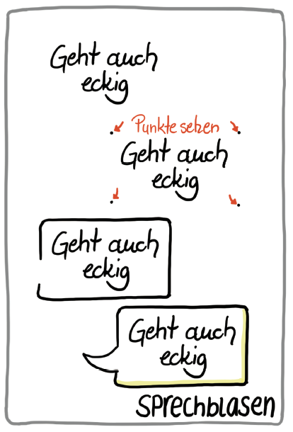

# **Vorwort**

Wird als letztes geschrieben :-)

# **Danksagung**

Vielen Dank an Simon Dückert für die inhaltliche, technische und moralische Unterstützung! Geschrieben wurde der Leitfaden von: Marjukka Zsagar-Renneberg, Raffaelina Rossetti, Benjamin Krüger, Lars Bartschat und Karl Damke

Geholfen haben dabei: (Hier werden **alle** Beteiligten wie folgt genannt :-)

Natalia Zlateva (Kata 7: Einkaufszettel) …. 

Mike Meister (Warm Up Kritzelvögel) … 

Dein Name im Kommentar einfügen (Feedback) ....

# **Einleitung**

Um diesen Leitfaden bestmöglich nutzen zu können, solltest du etwas über lernOS wissen, auf dem dieser Leitfaden aufbaut. lernOS ist eine Toolbox für lebenslanges Lernen, die Elemente aus Systemen wie Working Out Loud, Getting Things Done und Objective Key Results miteinander kombiniert. Dazu das wichtigste in einer Sketchnote:

LernOS in a nutshell by Karl Damke CC-BY 

Wenn du mehr wissen willst, kannst alles über lernOS [hier nachlesen,](https://cogneon.github.io/lernos-core/) dort den Leitfaden herunterladen oder dir [diesen Podcast](https://colearn.de/clp066-aufzeichnung-cl-sprint-12-4-2019-die-kunst-des-selbstgesteuerten-lebenslangen-lernens/) mit lernOS Mastermind Simon Dückert anhören. Im lernOS Sketchnote Leitfaden werden wir an einigen Stellen auf bestimmte Inhalte aus dem lernOS Leitfaden oder weiterführende Ressourcen verweisen. Mach dir aber keinen Stress und konzentriere dich auf die Inhalte und Methoden, die für dich unmittelbar wichtig sind - so hast du noch etwas übrig für die nächsten Sprints ;)  

**Warum ein Sketchnote Lernpfad?**

Na klar, Übung macht den Meister und Sketchnotes sind für jeden etwas anderes.

Was aber immer hilft beim besser werden, sind Motivation, konstruktives Feedback und Zugang zu guten Ressourcen zum Thema. Dafür haben wir den lernOS Sketchnote Lernpfad entwickelt. Er enthält  

a) eine Einführung ins Sketchnoting & Wissen zu Material und Grundlagen (Kapitel 4) 

b) 23 Katas (Übungen) zu den wichtigsten Bereichen des Sketchnotens (Kapitel 5)

c) Ressourcen zum weiterlernen, vernetzen und inspirieren lassen

Der Lernpfad soll für alle “Level” funktionieren, egal ob du seit 5 Minuten oder 5 Jahren sketchnotest. Wenn du ganz am Anfang stehst, wird dir sicherlich Kapitel 3 dabei helfen den Einstieg zu schaffen.  

# **Sketchnote-Grundlagen**

...

## **Was sind Sketchnotes ?**

*"Sketchnotes sind visuelle Notizen, die aus einer Mischung aus Handschrift, Zeichnungen, handgezeichneter Typografie, Formen und grafischen Elementen wie Pfeilen, Kästen & Linien bestehen."*, *- Mike Rohde, Autor des* [*Sketchnote Handbuchs*](http://rohdesign.com/) *und "Erfinder" des Begriffs Sketchnote*

*"Sketchnotes ist Rumkritzeln während du dir Notizen machst"* *- Kevin Thorn,* [*Nuggethead*](http://nuggethead.net/2013/01/what-are-sketch-notes/)

**Sketchnote what by @Bartschat, CC BY 4.0**

Wer hat nicht als Kind auf sämtliche Oberflächen gemalt, gezeichnet und vor allem gekritzelt? Das Kritzeln (englisch: Doodling) ist ein super-einfacher Weg, Informationen zu verstehen und mit anderen zu teilen. Sunni Brown beschreibt das sehr eindrücklich in ihrem TED Talk "[Doodlers, unite!](https://www.ted.com/talks/sunni_brown?share=11cb8401a9&language=en#t-29444)". In ihrem Buch "The Doodle Revolution" zeigt Sunni, wie stark das Skizzieren von Informationen Innovation und kreatives Denken motiviert, indem sie kurz und bündig, sowie einfach verständlich auf den Punkt gebracht werden.

Von einem wissenschaftlichen Standpunkt aus werden Sketchnotes durch die "[Dual Encoding Theorie](https://en.wikipedia.org/wiki/Dual-coding_theory)" gestützt. Diese beschreibt, dass Informationen die doppelt, also in unserem Fall als Text und Bild, kodiert und abgespeichert werden, stärker verankert werden. Sie lassen sich später schneller und genauer wieder erinnern, als "einfache" Textnotizen. Das Nutzen von Stift und Papier, oder auch digitalem Stylus und Tablet, hat also immense Vorteile gegenüber bspw. dem Mittippen am Laptop in einer Vorlesung oder einem Meeting. (s. Artikel von [Oppenheimer und Mueller](https://journals.sagepub.com/doi/10.1177/0956797614524581)) Das tiefe Verständnis von Konzepten und Ideen erschließt sich dem Sketchnoter also viel schneller und einfacher als dem "Mitschreiber", der Wort für Wort alles zu Papier bringt oder in sein Notebook hackt.

Vielleicht liegt das daran, dass beim Rumkritzeln und Skizzieren ein Prozess im Gehirn abläuft, der konstruktiv ist. Wir müssen dafür die verschiedenen Elemente wie Legosteine zusammenbauen und dabei unser Wissen integrieren und organisieren, damit kein totales Chaos auf dem Papier entsteht. Wie Hazel Messenger in ihrem Artikel "[Drawing Out Ideas](http://creativeapproachestoresearch.net/wp-content/uploads/CAR9_1_Messenger.pdf)" weiter schreibt, wird durch die Verbindung von Spüren, Fühlen, Denken und Tun auch neues Wissen erzeugt, also aus all diesen Bauelementen konstruiert.

**Sketchnote science by @Bartschat, CC BY 4.0**

## **Was kann ich denn Sketchnoten?**

Du kannst fast alles Sketchnoten:

- Rezepte
- Prozesse
- Organisationen
- Geschichten
- Marketingpläne
- Geschäftsmodelle
- Uni-Vorlesungen
- Matheunterricht
- Predigten in der Kirche
- Beziehungslandkarten
- Theaterstücke
- Buchinhalte

Du kannst mit Sketchnotes also:

- Probleme lösen
- Ideen finden
- Geschichten erzählen
- Reich werden (vielleicht...)
- Spaß haben
- Besser zusammenarbeiten
- Dein Wissen teilen!

## **Was brauche ich zum Sketchnoting?**

Das klingt ja alles ganz nett, aber was brauche ich denn um mit dem Sketchnoten anfangen zu können? Ist das nicht alles total kompliziert und komplex? Zum Glück nicht! Das einzige was Du tatsächlich brauchst, sind ein Stift und eine Unterlage auf der du Sketchnoten kannst, das kann ein Block, ein Notizbuch oder auch eine Serviette sein. Natürlich kannst du heute auch digital auf deinem Tablet Sketchnoten.

### **Sketchnotes mit Stift und Papier**

Sketchnotes mit Stift und Papier sind die "ursprüngliche" Art der Visuellen Notizen, du kannst sie jederzeit und überall anfertigen, solange du etwas Papier und einen Stift hast. Diese "analoge" Vorgehen hat viele Vorteile. Einige sind sehr subjektiv, am besten du bildest dir deine eigene Meinung:

- Dein Papier hat keinen Akku, der genau dann leer ist, wenn du grad Sketchnoten willst...
- Stift und Papier schicken dir nicht ständig Notifications und lenken dich mit deinem Insta-Feed ab...
- Wenn dein Notizbuch nass wirst, kannst du es trocknen und es wird danach vermutlich noch lesbar sein. Wirf mal dein Tablet in die Badewanne....
- Auf Papier zu schreiben und zu zeichnen fühlt sich einfach "richtig" an...
- Stift und Papier haben ein sehr intuitives Benutzer-Interface
- In einem digitalen Zeitalter bist du mit Stift und Papier fast schon ein Rebell...
- Eine Sketchnote auf Papier kannst du jemanden in die Hand geben, du kannst sie anfassen und haptisch erleben.
- Stift und Papier sind die günstigste Art zu Sketchnoten!

Natürlich hat jede Medaille zwei Seiten, ein paar Dinge können Stift und Papier nicht so gut:

- Um eine analoge Sketchnote online zu teilen, musst du sie erst einscannen oder abfotografieren.
- Copy and Paste bzw. Cut and Paste sind mit Papier zwar grundsätzlich möglich, aber sehr sehr aufwändig!
- Elemente vergrößern und verkleinern ist auch nicht so wirklich drin...
- ...

Auch wenn dir viele Webseiten etwas anderes erzählen, du brauchst weder spezielles Papier oder besonders teure Notizbücher, noch sind teure Stifte notwendig. Für den Anfang nimmst du einfach ein Blatt Papier aus dem Drucker und den erstbesten Stift, der auf deinem Schreibtisch liegt.

#### **Stift-Empfehlungen**

Verweis auf <https://sketchnotehangout.com/resources/> ?

#### **Papier-Empfehlungen (Notizbücher usw.)**

Verweis auf <https://sketchnotehangout.com/resources/> ?

### **Sketchnotes Digital**

Mittlerweile kannst du auch super digital sketchnoten. Dafür empfiehlt sich in der Regel ein Tablet Computer, die meisten Smartphones sind noch zu klein. (Ein Samsung Galaxy Note könnte aber schon reichen, wie es Opels Art[ hier](https://www.youtube.com/watch?v=Lai-GBlRq9Y) zeigt...) Etwas komfortabler sind die meisten Tablets, wie bspw. das Apple iPad (Pro), das Samsung Galaxy Tab oder die Microsoft Surface Reihe.

Das digitale Sketchnoten bringt einige immense Vorteile mit sich:

- Du kannst (je nach App) super einfach Elemente verschieben, vergrößern und verkleinern, ausschneiden und kopieren.
- Das online Teilen ist quasi eingebaut...
- Deine Sketchnotes sind in einem Dateisystem abgelegt und vielleicht sogar durchsuchbar...

Wie schon Stift und Papier, hat auch das Sketchnoten auf dem Tablet ein paar Nachteile:

- Mit einem leeren Akku guckst du echt in die Tonne...
- Lass das Tablet lieber nicht fallen, weder in die Badewanne noch auf den Fußboden!
- So ein Tablet mit einem Stylus (Stift) ist nicht wirklich günstig...
- Auf Glas schreiben und zeichnen fühlt sich, mindestens am Anfang, merkwürdig an.
- Du musst deine App sehr gut kennen, wenn du flüssig Sketchnoten möchtest

## **Sketchnote Elemente**

Egal was das Thema ist, für deine Sketchnotes benutzt du immer wieder die gleichen Elemente. Wenn du diese grundlegend trainieren willst, oder mal wieder etwas Inspiration und Abwechslung brauchst, empfehlen wir dir “Sketch it - Das Kartenspiel” von Wibke Tiedmann und Stefanie Maurer, dass du [hier herunterladen kannst](https://sketchnotegame.wordpress.com/download-kartenspiel/) und unter CC BY SA 4.0 verwenden darfst.  Alle folgenden Beispiele zu den Sketchnote Elementen stammen aus diesem Spiel.

*„*[*Sketch it – Das Kartenspiel*](https://sketchnotegame.wordpress.com/download-kartenspiel/)*„ von*[ *Wibke Tiedmann & Stefanie Maurer*](https://sketchnotegame.wordpress.com/ueber/)*, Lizenz:*[ *CC BY-SA 4.0*](https://creativecommons.org/licenses/by-sa/4.0/deed.de).

### **Container**

Ein Container strukturiert eine Sketchnote, indem er anderen Elementen einen Rahmen bietet.

### **Trenner**

Der Trenner ist der Gegenspieler zum Verbinder, er sorgt dafür, dass die Elemente einer Sketchnote klar voneinander separiert sind und schafft so Ordnung und Klarheit.

### **Text**

Deine Sketchnote besteht aus Text und grafischen Elementen, wobei auch die Texte unterschiedlichste Formen und Farben annehmen können.

### **Symbole und Icons**

Symbole und Icons kannst du auf unterschiedliche Arten und Weisen beim Sketchnoten einsetzen. Du kannst dir bspw. ein eigenes Icon-Set anlegen, mit dem du wiederkehrende Elemente kennzeichnest. Ein Klassiker ist die aufleuchtende Glühbirne für eine Idee oder das Ausrufezeichen für etwas, das besonders wichtig ist.

### **Verbinder und Pfeile**

Verbinder und Pfeile sind starke Strukturelemente beim Sketchnoten. Sie erzeugen den Flow, dem das Auge des Betrachters folgt. Sie zeigen, welcher Teil auf welchen folgt, bspw. in einer zeitlichen oder logischen Abfolge. Verbinder und Pfeile halten deine Sketchnote zusammen.

### **Diagramme**

Mit Diagrammen kannst du super Daten in deiner Sketchnote visualisieren. Oft sind Programme wie Excel ein wenig "zu viel". Mit ein wenig Übung kannst du aus Elementen, wie Balken, Linien und Kreisen einfache, aber sehr wirkungsvolle Diagramme erschaffen. Ein sehr beeindruckendes Beispiel für analoge Datenvisualisierung ist das Projekt "[Dear Data](http://www.dear-data.com/theproject)" von Giorgia Lupi und Stefanie Posavec, die sich über ein Jahr gegenseitig Postkarten mit handgezeichneten Visualisierungen geschickt haben.

### **Zeichnungen**

...

**Sketchnote Workflows**

### **"One and Done" und Iteratives Sketchnoten**

Ein "One and Done"-Sketchnoter erstellt seine Sketchnote zum Beispiel bei einem Talk auf einer Konferenz oder während eines Meetings. "One and Done" bedeutet, dass er mit der Sketchnote fertig ist, sobald das Ereignis beendet ist. Vielleicht wird am Schluss nochmal das ein oder andere kleine Detail korrigiert oder ergänzt, aber "One and Done" ist quasi "Live".

Beim Iterativen Sketchnoten arbeitest du in mehreren, meist zwei, Stufen. Während des Events erstellst du eine grobe Entwurfsversion deiner Sketchnote, die anschließend nach dem Event überarbeitet und finalisiert wird. So kannst du detaillierter und genauer arbeiten als beim "One and Done" Ansatz, brauchst allerdings auch deutlich mehr Zeit bis das endgültige Produkt fertig ist.

Einen noch tiefergehenden Prozess beschreibt Mauro Toselli, bekannt als[ @xLontrax](https://twitter.com/xlontrax), in seinem Buch "[The xLontrax Theory of the Sketchnote](https://www.maurotoselli.com/the-xlontrax-theory-of-sketchnote.html)":

- Mauro sammelt das Material und erstellt die erste Sketchnote
- Anschließend lässt sie bis zur nächsten Session liegen und "reifen"
- Die Sketchnote wird dann genau untersucht,
- bevor alles Überflüssige entfernt wird

Mauro definiert dafür den "Eraser Critical Point", den er definiert als "Anzahl der Elemente, die du aus deiner Sketchnote entfernen musst, um ihre Bedeutung zu kompromittieren". So sorgt sein Ansatz dafür, dass eine Sketchnote exakt die richtige Anzahl an Elementen hat, um den gewünschten Inhalt vermitteln. Laut seiner Erfahrung erfolgt dieser komplexe Prozess bei geübten "One and Done"-Sketchnotern automatisiert während des Sketchnotens.

Welcher Workflow der richtige ist? Das hängt von vielen Dingen ab:

- Was bist du selber für ein Typ?
- Was passt zur aktuellen Situation?
- Wieviel Zeit hast du?
- Wie möchtest du deine Sketchnote hinterher verwenden?

Hier gibt es kein Richtig oder Falsch, Sketchnote wie du es brauchst!

# **Der Sketchnote Lernpfad**

Wenn du dich 12 Wochen mit einem Thema beschäftigst, ist das gleichzeitig sehr viel und sehr wenig Zeit. Die Katas in diesem Leitfaden sollen dir dabei helfen, das Beste aus dir und deinem Circle herauszuholen. Sie sind so aufgebaut, dass sie sowohl für Anfänger als auch für Fortgeschrittene geeignet sind. Nehmt euch vor Start des Sprints Zeit, den Aufbau und die einzelnen Katas genauer anzuschauen. Manchmal gibt es mehrere Katas in einer Woche, sucht euch eine aus, oder macht beide, je nach Lust und Laune. Es gibt keine Kata-Polizei: Tauscht gerne Katas aus oder modifiziert sie, damit sie besser zu euren Zielen passen.

Wie ist dieser Lernpfad aufgebaut?

Lass uns das aus zwei Perspektiven betrachten. Zuerst schauen wir, wann deine individuellen Ziele im Laufe der zwölf Wochen Thema im Circle sind. Dann schauen wir uns an, nach welchem System die Katas aufgebaut sind.

CC BY: Karl Damke

Sketchnoten ist für jeden etwas anderes und wird auch für dich, je nach Situation, immer anders sein. Trotzdem gibt es grundlegende Qualitäten, die eine Sketchnote auszeichnen, die du dir nach Jahren noch gerne anschaust und die z.B. auch für deine Kolleginnen verständlich ist. Der Sketchnoter Mauro Toselli, den wir oben schon erwähnt haben, hat sich jahrelang mit diesen Qualitäten beschäftigt u

nd dazu ein großartiges [Buch geschrieben](https://www.maurotoselli.com/the-xlontrax-theory-of-sketchnote.html). Wir haben seine Einteilung der Qualitäten einer Sketchnote übernommen und die Katas auf ihnen aufgebaut. Im Anhang findest du dazu vier Seiten aus Mauros Buch dazu, die unter CC BY ND SA genutzt werden können.

CC BY: Karl Damke

++++sketchnote Kata Overview ganzseitig ++++

Hier wird es eine a4 Sketchnote als Poster mit allen Katas als Übersicht geben - die wir aber erst am Ende einfügen :-)

## **Circle Organisatoren Checkliste**

**#ProTip:** in vielen Fällen ist die Zeit für das Ausführen der Übungen im Weekly zu kurz. Wir nutzen[ daher die Flipped Classroom](https://en.wikipedia.org/wiki/Flipped_classroom) Methode. Für jeden Weekly gibt es eine Kata, die jedes Circle-Mitglied als “Hausaufgabe” vorbereitet, so dass Ihr im Weekly mehr Zeit habt, die Ergebnisse zu besprechen. Das wird begleitet durch Leitfragen, die ihr gerne ergänzen könnt und immer wieder gibt es auch Katas, die ihr gemeinsam während des Weeklys absolviert.

Auf den nächsten Seiten findest du den Ablaufplan für den Sprint in Kurzform. Die Erklärungen für die einzelnen Katas und Warm-Ups folgen dann auf den Seiten danach.

### Woche 0: Den Sprint planen und Absprachen treffen

Bevor es losgeht, investiert etwas Zeit um euch kennenzulernen und die Rahmenbedingungen für euren Sprint abzusprechen.

**Als Vorbereitung**

Kata 1: Sketchnote-Selfie

**Im Weekly**

Check in (2 Minuten pro Member)

Warm Up: Kringel-Vögel (5 Minuten)

Vorstellung (5 Minuten pro Member)

**Leitfragen**:

- Arbeitest du lieber digital oder analog?

- Nutzt du Sketchnotes eher privat oder beruflich?

- Wie lange machst du schon Sketchnotes?

- Was sind deine Lieblingsmaterialien (Papier, Stifte, Programme) ? 

Kata 2: Circle Setup (20 Minuten)

Kata 3: Feedback (10 Minuten)

Check Out (1 Minute pro Member)

### Woche 1: Ziele festlegen

In dieser Woche wählst Du Dein Ziel für den Sprint. 

**Als Vorbereitung**

Kata 4: Mein Ziel für die nächsten 12 Wochen

Kata 5: Ein Termin mit dir selbst

**Im Weekly**

Check in (2 Minuten pro Member)

Warm Up: Ziele (5 Minuten) 

Wie visualisiert ihr Ziele? Zeichnet Icons und vergleicht sie miteinander  Wie visualisiert ihr, dass die Ziele erreicht wurden? 

**Austausch: Eure Ziele im Sprint (10 Minuten pro Member)**

Teilt eure Ziele aus Kata 4 miteinander

**Leitfragen**:

- Warum machst du das?  

- Was inspiriert dich daran ?

- Was heißt es für dich ein Ziel erreicht zu haben?

- Wie hast du deine Ziele nach OKR quantitativ meßbar gemacht?

- Wie feierst du, wenn du dein Ziel erreicht hast?

**Austausch: Ein Termin mit Dir selbst (5 Minuten)**

Habt ihr alle einen Termin mit euch selbst in den Kalender eingetragen? Was hat euch dabei geholfen?

Check-Out (1 Minute pro Member)

### Woche 2: Schrift & Lesbarkeit

**Als Vorbereitung**

Kata 6: Letter deinen Lieblingsspruch

Kata 7: Nimm dir Zeit beim Schreiben 

**Im Weekly**

Check in (2 Minuten pro Member)

Warm Up: Ganz groß und ganz klein. 

Feedback, Austausch und Tipps zu den Katas (40 Minuten)

**Leitfragen**:

- Wie nutzt du unterschiedliche Schriften in deinen Sketchnotes?

- Welche deiner Schriften nutzt du wofür?

- Welche deiner Schriften gefällt dir besonders gut? Welche nicht?

- Möchtest du eine neue Schrift lernen und wofür brauchst du sie?

- Wie hängen für dich Stifte und Schrift zusammen? Mit welcher Stiftstärke kannst du am besten zeichnen und schreiben? Wie hierarchisierst du mit Schriftgröße, Fonts und Stiftstärken?

Zeigt euch gegenseitig (eigene) Beispiele, die ihr besonders gelungen findet

Check-Out (1 Minute pro Member)

### Woche 3: Visuelles Vokabular

**Als Vorbereitung**

Kata 8: Einkaufszettel

Kata 9: Bildersammlung

**Im Weekly**

Check in (2 Minuten pro Member)

Warm Up: Icons 

Alle bringen einen Begriff mit, den sie spannend oder schwer zu visualisieren finden. Alle Begriffe werden in je 30 Sekunden gesketcht und dann verglichen. (5 Minuten)

Austausch über die Kata(s) (40 Minuten)

**Leitfragen**: 

- Wie gut ist euer Visuelles Vokabular? 

- Wie sammelt/dokumentiert ihr eure Icons?

- Welche Methoden nutzt ihr um sie immer greifbar zu haben?

- Wollt ihr weiter Icons sammeln und wie wollt ihr sie teilen? 

- Welche Icons sind eure Top 5 - Icons , die ihr immer wieder in Sketchnotes verwendet?

- Wie zufrieden seid ihr mit Ihnen? 

- Könnt ihr noch etwas an ihnen verbessern? 

- Sketcht das Icon, das ihr verbessern wollt und befragt die anderen.

Check out (1 Minute pro Member)

### Woche 4: Struktur durch Stifte und Farbe

**Als Vorbereitung**

Kata 10: Was bedeuten Farben für dich?

Kata 1: Nie genug Stifte

**Im Weekly**

Check in (2 Minuten pro Member)

Warm Up: Weniger Details bitte (5 Minuten)

Kata 12: 1 Sketchnote 5 Farben (20 Minuten)

Bereitet die Kata vor und beendet sie gemeinsam

Austausch über die Katas (25 Minuten)

**Leitfragen**:

- Welche Farben passen zu deinen Themen?
- Wechselt ihr die Farben abhängig von den Themen?

- Wie schafft ihr es Struktur zu schaffen, selbst wenn ihr nur wenige Stifte habt?

Check Out (1 Minute pro Member)

### Woche 5: Struktur durch Layout

**Als Vorbereitung**

Kata 13: Layouts für Sketchnotes 

**Im Weekly**

Check in (2 Minuten pro Member)

Warm Up: Container (5 Minuten)

Zeichnet verschiedene Container und besprecht, wofür sie sich eignen. (Eine Wolke steht zum Beispiel eher für eine Idee als für ein Ergebnis/Beschluss)

Kata 14: Videosketching (40 min)

Check Out (1 Minute pro Member)

### Woche 6: Dein Zwischenstand

**Als Vorbereitung**

Bereite dich auf deine Präsentation im Weekly vor. 

**Im Weekly**

Check in (2 Minuten pro Member)

Warm Up: Was mit Feedback (5 Minuten)

Kata 15: Zwischenstand präsentieren (10 Minuten pro Member)

Check out (1 Minute pro Member)

### Woche 7: Verständlichkeit

**Als Vorbereitung**

Kata 16: Videosketching: Did you get it?

**Im Weekly**

Check in: (2 Minuten pro Member)

Warm Up: Draw Toast 

Austausch über die Kata

**Leitfragen**:

- Was hat besonders gut funktioniert?

…

…

Check out (1 Minute pro Member)

### Woche 8: Sharing for feedback

**Als Vorbereitung**

Kata 17: Feedback on Content

**Im Weekly**

Check in (2 Minuten pro Member)

Warm Up: 

Austausch über Kata 16 (20 Minuten)

**Leitfragen**:

- Wo und wie hast du deine Sketchnote geteilt? 

- Wie komfortabel/unkomfortabel war es? 

- Welche Art Feedback hast du erhalten?

- Wie genau fragst du nach Feedback?

Kata 18: Top5 Ressourcen (20 Minuten)

Check out (1 Minute pro Member)

### Woche 9:  Vertiefen des eigenen Projekts 

**Als Vorbereitung**

Entscheidet euch, welche Schwerpunkte ihr setzen wollt: 

Wenn du in diesem Sprint ein eigenes Projekt bearbeitest, das du bis Woche 11 abgeschlossen haben möchtest, nimm dir jetzt noch einmal Zeit daran zu arbeiten und dir Feedback dazu einzuholen.

Wenn du kein konkretes Projekt/Produkt hast, nutze die Katas 19 und 20/21 für eine Reflexion des Sprints und dem bisher Gelernten.

Kata 19: Soulshine-Selfie

Kata 20: Reflexions - Sketchnote (Teil1) “Struktur-Gedanken” 

**Im Weekly**

Warm Up: visuelle Kommunikation macht den Unterschied (5 min)

Feedback zu euren Projekten, Austausch über Kata 19 & 20 und freie Wiederholung

Check out (1 Minute pro Member)

### Woche 10: Spass muss sein!

**Als Vorbereitung**

Überleg dir Begriffe für Kata 22: Montagsmaler 

Kata 21: Reflexions-Sketchnote (Teil 2) “Der strukturierte Pfad” 

**Im Weekly**

Check in (2 Minuten pro Member)

Austausch über Kata 21

Kata 22: Montagsmaler (25 min)

Check out (1 Minute pro Member)

### Woche 11: Finale Produkte und Lessons Learned

**Als Vorbereitung**

Kata 23: Miß & zeig deinen Erfolg 

**Im Weekly**

Check in (2 Minuten pro Member)

Präsentationen (10 Minuten pro Member)

Check out (1 Minute pro Member)

### Woche 12: Reflexion und Abschluss

**Als Vorbereitung**

Wie geht es weiter? Was nimmst du dir als nächstes vor? 

**Im Weekly**

Check in (2 Minuten pro Member)

Warm Up: längeres, interaktives Warm Up

freies Programm 

Check out (1 Minute pro Member)



# **Kata-Log**

### Kata1: Sketchnote-Selfie

Um dich den anderen in deinem Circle vorzustellen, zeichne eine Sketchnote über dich. Bau die wichtigsten Fakten über dich ein, erwähne Dinge die du (nicht) magst, zwei Fakten über dich, der nicht offensichtlich sind und einen praktischen Sketchnote-Tipp. Versuch auch die Frage zu beantworten, warum du visualisierst. Wenn du fertig bist, teile deinen Sketchnote-Selfie mit den anderen.

### Kata 2: Circle Setup 

Wenn Ihr Euch im Circle noch nicht kennt, lernt Euch in der Woche 0 kennen. Plant, wann Ihr Euch trefft, welche Tools Ihr nutzt und wer der Moderator ist.

- **Check-in:** Herzlich willkommen! (5 Minuten)
- **Get together**: Wer bist du? Stell Dich vor. Hier solltest Du natürlich anhand deines Sketnote-Selfie vorgehen. (Fünf-Minuten-Timebox pro Circle-Mitglied)
- **Sprint Planung** siehe unten (25 Minuten)
- **Check-out**: Das nächste Treffen bestätigen. (5 Minuten)

Definiert einen Circle-Moderator, der sich um Event- und Zeitmanagement kümmert. Eines der größten Hindernisse für erfolgreiche Circle ist Disziplin und Zeitmanagement. Der Moderator ist nicht der "Chef" des Circle, sondern ein normales Circle-Mitglied, das sich um einen reibungslosen Ablauf kümmert. Definiert Tag und Uhrzeit des wöchentlichen Treffens. Definiert, ob Ihr Euch persönlich oder virtuell trefft. Definiert die Tools, die Ihr für Kommunikation und Dokumentation im Circle verwendet. Entscheidet, welche der vorgeschlagenen Übungen Ihr im Kreis machen wollt. 

- Circle-Moderator: ...
- Tag und Uhrzeit des Weekly: ...
- Wöchentliche Treffen sind: persönlich / virtuell
- Verwendete Tools (können alle sie nutzen?): ...

### Kata 3: Feedback !

Eine ganz wichtige Funktion des Circles ist es, Feedback zu deinen Zielen und zu deinen Sketchnotes zu bekommen und den anderen Feedback zu geben. Damit ihr euch dabei besser versteht, nehmt euch kurz Zeit über eure Vorstellung von konstruktivem Feedback zu sprechen. Dazu gehört auch die Frage „Warum visualisierst du? und der Grundsatz „Vergleich dich mit dir selbst“. 

**Weitere Informationen:**

Brandyfesto: [Drawing as a thinking tool
](http://www.loosetooth.com/brandyfesto/index.htm)Video Doug Neill: [Sketchnoting is a superpower](https://www.youtube.com/watch?v=lQft0_nL9eI)

Video: Doug Neill: [How to critique your sketchnote](https://www.youtube.com/watch?v=BPHA2-uxBto)

### Kata 4: Meine Ziele für die nächsten 4 Wochen

Was willst Du in den nächsten zwölf Wochen erreichen? Wähle ein Ziel, das Dich wirklich, wirklich wichtig ist und bei dem Du im Sprint Fortschritte machen kannst. Du wirst die die OKR-Methode von Google verwenden, um dieses Ziel zu definieren. Besonders für Sketchnote-Einsteiger ist es nicht oberste Priorität, das Ziel zu erreichen.  Im Fokus steht neben dem Erlernen des Basiswissen wie zum Beispiel das Aneignen eines eigenen visuellen ABCs natürlich ganz besonders das regelmäßige Üben der neu gewonnenen Fähigkeiten und zu guter Letzt die Hauptsache:  ganz viel Spaß :-)

Um einen optimalen Lernerfolg zu bekommen ist es dennoch sehr  wichtig, dir selbst Ziele zu setzen, die dich motivieren und mit denen du deine Fortschritte greifbar und sichtbar machen kannst. Überlege ob du vielleicht auf ein konkretes Produkt hinarbeiten möchtest. Das könnte zum Beispiel ein Sketchnote Workshop für deine Kolleg*innen sein, oder dein erstes Graphic Recording, oder, oder, oder...

Überlegt euch, wie ihr euren Fortschritt in euren OKRs teilen wollt. Allein im Check-In ist ein bisschen wenig. Gibt es in eurem Dokumentations-Tool eine Möglichkeit dafür, euren Fortschritt zu protokollieren?

**Weitere Informationen:**

- Wikipedia Artikel [SMART Criteria](https://en.wikipedia.org/wiki/SMART_criteria)
- MIT Sloan Artikel [With Goals, FAST Beats SMART](https://sloanreview.mit.edu/article/with-goals-fast-beats-smart)
- Ted Talk [How We Can Make the World a Better Place by 2030](https://www.youtube.com/watch?v=o08ykAqLOxk)
- Video How Google Sets Goals: [OKRs mit Google Ventures Partner Rick Klau](https://www.youtube.com/watch?v=mJB83EZtAjc)
- Buch [Introduction To OKRs von Christina Wodtke](https://www.oreilly.com/business/free/files/introduction-to-okrs.pdf)
- Buch [The Beginner’s Guide To OKR von Felipe Castro](https://felipecastro.com/resource/The-Beginners-Guide-to-OKR.pdf)

### Kata 5: Ein Termin mit Dir selbst

Nimmst Du Dir ausreichend Zeit für Deine persönliche Entwicklung und für die Arbeit an Deinen Zielen? Viele Menschen sind mit ihren täglichen Aufgaben beschäftigt und kümmern sich nicht genug um Ihre Entwicklung und Ihr Wohlbefinden. Ein guter Ansatz ist es, einen Termin mit sich selbst zu vereinbaren und sich diese Zeit im Kalender zu reservieren.

**Übung (15 Minuten):**

Überprüfe Deinen Kalender und suche nach möglichen Terminen mit Dir selbst. Eine Stunde oder sogar 30 Minuten pro Woche ist ein guter Ausgangspunkt. Trage Dir einen Termin mit Dir selbst in den Kalender ein. Mache ihn nach Möglichkeit zu einem wiederkehrenden Termin, damit diese Zeit für Dich zur Gewohnheit wird. Finde mindestens fünf Termine:

1. …

2. …

3. …

4. …

5. …

Besprecht Eure Ansätze im Circle.

### Kata 6: Letter deinen Lieblingsspruch 

Eine Sketchnote lässt sich sehr gut mit verschiedenen Schriftarten und -größen gestalten und gliedern. Doch oft fallen wir beim Sketchnoten wieder zurück in unseren Gewohnheiten und nutzen immer nur die selben, alten Lettern.

Nimm dir für diese Kata ein Din A 5 Blatt und einen nicht zu langen Spruch deiner Wahl. Überlege dir, welche Wörter du in welcher Schrift und in welcher Größe schreiben möchtest. Was ist besonders wichtig, wo schwingt welche Emotion mit? Vielleicht machst du auch erst einmal eine kleine Bleistiftskizze für die Größenverhältnisse und zeichnest dann in sauber nach. Wenn du Inspiration für Schriften brauchst, schau dir doch die entsprechenden Karten im Sketchnote Game an. 

**Weitere Informationen:**

Videos: [How to Write Neatly + Improve Your Handwriting
](https://www.youtube.com/watch?v=_QA_NScPlt8)[How to Improve your Handwriting | For Note-Taking and Journaling
](https://www.youtube.com/watch?v=1YXjAu9o11o)[5 tips on how i improved my handwriting](https://www.youtube.com/watch?v=aK2SLQx6j9Q)

### Kata 7: Nimm Dir Zeit beim Schreiben 

Ein Killer-Kriterium für eine gute Sketchnote ist ihre Lesbarkeit. Vor allem wenn wir oft viel zu viel auf Tastaturen herumtippen und im Alltag nicht viel mit der Hand schreiben, ist die antrainierte  Schönschrift aus der Grundschule oft nur noch eine blasse Erinnerung.

Im Anhang findest du ein Übungsblatt zur “Architects Handwriting”, die für ihre sehr gute Lesbarkeit bekannt  ist. Wenn du deine eigene Handschrift oft kaum lesen kannst, solltest du dir vielleicht regelmäßig etwas Zeit nehmen um diese Schrift zu trainieren.

Eine andere Herangehensweise ist es, dir einmal deutlich mehr Zeit fürs Schreiben zu nehmen und zu schauen, welche Auswirkungen das auf deine Lesbarkeit hat. Schreib dazu einen kurzen Satz in deiner normalen Handschrift und stopp dabei (ungefähr) die Zeit. Schreib dann den gleichen Satz noch einmal, mit doppelt so viel Zeit und vielleicht noch einmal, noch langsamer. Schau dir die Buchstaben genau an, was verändert sich? Beschleunige jetzt allmählich wieder und versuche dabei die positiven Veränderungen beizubehalten.Ressource dazu: Architects Handwriting

### Kata 8: Einkaufszettel

Erstelle dein Einkaufszettel statt mit Wörtern mit Sketchnotes. Übe auf dieser Weise unterschiedlichen Symbolen für Gemüse, Obst, Tiere, Getränke, Lebensmittel und Drogerieartikel. Nach einem Monat schaue dir dein Einkaufszettel an und erstelle für jede der 6 Kategorien eine eigene visuelle Bibliothek.

1 Einkaufszettel - 10 Minuten

Dauer der Kata - 1 Monat

Ergebnis - 6 Kategorien für deine visuelle Bibliothek Submitted by Natalia Zlateva @nataliaoro on instagram

### Kata 9: Bildersammlung

Lege Dir für deine Themen eine Bildbibliothek an. Notiere dafür 10 Schlüsselbegriffe aus deinem Themenbereich. Und nun suche in deiner Umgebung, in Büchern, in Bildern und Medien nach Anregungen für deine eigene Darstellung. Zeichne unterschiedliche Varianten oder nur eine. Wähle aus, was am besten zu dir passt. Das speichere in deiner Sammlung.

Stelle im Weekly deine Ideen vor und diskutiere in der Gruppe darüber. Diskutiert, wo ihr die besten Anregungen gefunden habt.

Submitted by Sabine Erkens @Sabine_Erkens on Twitter 

**Weitere Informationen:**

[The noun project](http://www.thenounproject.com) - freie online-Datenbank mit Bildsymbolen
Video Doug Neill: [How to expand your visual language - Build up from basic icons to more complex representations of ideas.
](https://www.youtube.com/watch?v=z8UkHGpykYU)John Atkinson - [Cartoons for Sketchnotes](https://wronghands1.com/)

### Kata 10: Was bedeuten Farben für dich?

Beantworte den Fragebogen (folgt) für dich

Tauscht euch über die Ergebnisse aus.

Gibt es Unterschiede in der Wahrnehmung?

Ändert sich daraus etwas für dich?

**Weitere Informationen:**

Video Brandy Agerbeck: [The color spectrum](https://www.youtube.com/watch?v=s5h0wOtEWcg) 

Ressource: Farbkreis

### Kata 11: #NieGenugStifte    

Man kann nie genug Stifte haben ;-) Aber für den Beginn reicht ein schwarzer und ein grauer Stift und eine weitere Farbe. Schau Dir andere Sketchnotes an und plane für dich, welche Stifte du benötigst. Mit welcher Stiftstärke kannst du am besten zeichnen und schreiben? Welche Farben passen zu deinen Themen? Zeichne einzelne Motive mit unterschiedlichen Stiften und finde deinen eigenen Stil heraus. Tauscht euch mit einander aus: Wo und wie setzt ihr Schatten? Wie kann Farbe Bedeutung transportieren?

Submitted by Sabine Erkens @Sabine_Erkens on Twitter 

### Kata 12: 1 Sketchnote 5 Farben

Bereite eine Sketchnote in Schwarz vor. Mach mehrere Kopien davon und bereite deine Farbstifte vor. Im Weekly koloriert ihr gemeinsam eure Sketchnotes auf unterschiedliche Art und Weisen. 

Vorschläge dafür: 

- wie immer
- totales Gegenteil vom typischen Stil
- nach einer Emotion  
- extrem viel Farbe
- Farbe nur für ein! Highlight
- Farbe als Hierachisierungs-Hilfsmittel

### Kata 13: Layouts für Sketchnotes

Vorbereitung:

\#cheat sheet anschauen – überlegen, welches Layout wofür geeignet ist

Welche dieser Layouts nutzt du bereits?

Welches Layout wolltest du immer schon einmal einsetzen

Trainier deine Container!

….

….

Ressource: Cheat Sheet maccymax

### Kata 14: Videosketching

Einigt euch auf ein Video, dass ihr gemeinsam live sketchnoten wollt. Wir empfehlen etwas unter 10 Minuten, vielleicht eine Sendung mit der Maus. Wenn ihr euch online trefft, schaut, ob ihr eure Kameras so aufstellen könnt, dass sie eure Sketchnote zeigt.

Im Weekly:

Schaut gemeinsam das Video und sketcht den Inhalt. Vergleicht danach die Sketchnotes miteinander.  -  welches Layout habt ihr warum gewählt?

- Konntet ihr das Layout wie geplant umsetzen?
- Entspricht das Ergebnis eurem Plan?
- Ist das Layout für die anderen nachvollziehbar?
- Was würdet ihr beim nächsten Mal anders machen?

Fehlt euch eine Layoutideee auf dem Cheat Sheet?

**Weitere Informationen:**

Vorschlag Video zum live sketchen: [Julian Treasure - How to speak so others want to listen](https://www.ted.com/talks/julian_treasure_how_to_speak_so_that_people_want_to_listen?language=en)

### Kata 15: Zwischenstand präsentieren

Bring deine OKR – Metriken mit – wenn du willst ;)

Machst du Fortschritte in deinen Key Results – wie schätzen das die anderen ein?

Wo willst du hin?

Wenn du an einem konkreten Produkt arbeitest, kannst du diesen Weekly nutzen um den anderen dein Minimal Viable Product zu präsentieren. 

Wenn du nicht an einem Produkt arbeitest, könntest du zum Beispiel ein Rework deines Sketchnote-Selfies machen mit den Techniken, die du in den letzten sechs Wochen trainiert hast. 

Siehst du Unterschiede? 

Sehen die anderen Circle-Member Unterschiede? 

### Kata 16: Videosketching: Did you get it?

Teilt euch in 2er Teams auf. Sucht euch beide ein kurzes Video zu einem interessanten Thema aus und sketchnotet es (ohne zu verraten, was ihr sketchnotet) . Teil dann das Ergebnis mit eurer Partnerin / eurem Partner. Diese/r schaut sich zuerst die Sketchnote an und schaut dann das Video. Bereitet euer Feedback vor, entweder macht ihr einen Einzeltermin oder ihr teilt euer Feedback im Circle.

Leitfragen für die Analyse und das Feedback:

Wie lesbar ist die Sketchnote?

…..Mauros Kategorien auflisten

### Kata 17: Feedback on Content

While sketchnoting, active listening and capturing the most important information (core theses) e.g. of a talk is very important. 

Why not reaching out to speakers or organizers to get feedback on the content of your sketchnote (is it complete? are the core theses captured?)?

In meetings it might be possible to ask the participants at the end of the event if one was able to capture the core theses in her or his sketchnote. If there are multiple sketchnotes of a talk the sketchnoter might compare and evaluate the captured information. 

Share your experiences on how to get feedback on the content of your sketchnote in your circle (20 minutes). Talk about learnings and reflect on how feedback on content helps you to improve your sketchnoting.

Submitted by: Katrin Mäntele @kleinerw4hnsinn (Twitter & Instagram)

### Kata 18: Top5 Ressources

Bücher / Gruppen / Videos/Youtube-Kanäle / inspirierende Vorbilder …

### Kata 19: SoulshineSelfie

What are things, people & situations you are thankful for? Do you spend enough time to think about the sunny side of life? All of us have those times when we forget about those happy moments! 

**Exercise (30 Minutes for a start ;)** 

Do a sketchnote about the things you love, like & appreciate. Draw yourself in the center (e.g. of a sun) and display your „happy-drawings“ around it. Make sure to label your drawings to benefit from the dual coding theory! 

Check out the [#SoulshineSelfie examples](https://www.instagram.com/explore/tags/soulshinekalender/) on Instagram or the [story behind it](http://www.vizworks.de/soulshine-kalender/). 

Submitted by Britta Ullrich / vizworks.de (Web & Instagram) 

### Kata 20: Reflexions - Sketchnote (Teil1) “Struktur-Gedanken”

Schritt 1: Mach drei Layoutskizzen für eine Sketchnote, die deine Erfahrungen in diesem Sprint wiedergibt 

Schritt 2: Wähle ein Layout aus

Schritt 3: Zeigt euch im Weekly eure Entwürfe. Warum habt ihr euch für welchen entschieden?  

inspired by Conni Eybisch-Klimpel @connieybisch (Instagram) 

### Kata 21: Reflexions-Sketchnote (Teil 2) “Der strukturierte Pfad” 

Zeichne die in Kata 20 skizzierte Sketchnote fertig und teile sie mit den anderen.

### Kata 22: Montagsmaler

Text für Montagsmaler

von Susanne Speer

### Kata 23: Miß & zeig deinen Erfolg 

Vorlage im Anhang: Spinnennetz und OKR Tracking Grafik

# **Warm-Ups**

### **Kringel-Vögel (Woche 0)**

Schritt 1: Kritzle auf einem Blatt Papier  innerhalb von einer Minute so viele Kringel wie möglich.

Schritt 2:Wenn ihr zu zweit arbeitet: tauscht eure Blätter, bist du allein (vor deinem Bildschirm), dann mach mit deinen eigenen Kringeln weiter.

Nimm einen zweiten, andersfarbigen Stift und vervollständige die Kringel mit Schnäbeln, Beinen, Flügeln, füge Schatten und Schattierungen hinzu wenn du möchtest.

Schritt 3: Zeige deine Kringel-Vogel Sammlung den anderen. Vielleicht möchtest du sie auch später auf Twitter oder Instagram teilen? Added from: Mike Meister @mm_mikemeister

### **Weitere Informationen:**

Video [Dave Gray - Squiggle birds
](https://www.youtube.com/watch?v=vK3yQBouzNs)Video [Hirameki - draw what you see](https://www.youtube.com/watch?v=IrLwkyWBB7w)

### **Ziele (Woche 1)**

Wie visualisiert ihr Ziele? Zeichnet Icons und vergleicht sie miteinander  Wie visualisiert ihr, dass die Ziele erreicht wurden? 

### **Ganz groß und ganz klein (Woche 2)** 

Einigt euch auf ein Wort. Alle schreiben es mit einem dicken Stift zuerst ganz groß und dann ganz klein. Wechselt dann den Stift und schreibt das Wort mit einem dünnen Stift erst ganz klein und dann ganz groß. Vergleicht die Ergebnisse miteinander: Wie schafft ihr es, dass alles immer lesbar ist und gut aussieht?  (5 Minuten)

### **Icons (Woche 3)**

Alle bringen einen Begriff mit, den sie spannend oder schwer zu visualisieren finden. Alle Begriffe werden in je 30 Sekunden gesketcht und dann verglichen. (5 Minuten)

*Variante 1: Danach mit #20secchallenge im Sketchnote Army Slack vergleichen*

*Variante 2: Aus den 5 Begriffen eine Mini-Geschichte machen*

#### **Weniger Details bitte (Woche 4)**

Erinnert euch gemeinsam an euer Lieblings-Icon aus der letzten Woche. 

Variante 1: Alle zeichnen das Icon in 30 Sekunden, dann noch einmal in 15 Sekunden, dann noch einmal in 5 Sekunden. Vergleicht die Ergebnisse.

Variante 2: Zeichnet das Icon einmal mit einem normalen Stift und dann mit einem viel dickereren Stift. Wie schafft ihr es, dass die Icons gut zu erkennen bleiben?

#### **Container (Woche 5)**

Zeichnet verschiedene Container und besprecht, wofür sie sich eignen. (Eine Wolke steht zum Beispiel eher für eine Idee als für ein Ergebnis/Beschluss)

#### **Warm Up (Woche 6)**

#### **Draw Toast (Woche 7)**

https://www.drawtoast.com/

#### **Warm Up (Woche 8)**

#### **Visuelle Kommunikation macht den Unterschied (Woche 9)**

Schritt 1: einer zeichnet für sich einen Kreis, ein Dreieck und ein Viereck auf ein Blatt Papier.  Ohne den anderen das Bild zu zeigen erklärt er nun sein Bild. Die anderen zeichnen nach seiner Erklärung dass Bild nach. (In der ersten Runde sind keine Fragen erlaubt, Kommunikation nur in einer Richtung) Anschließend zeigen sich alle ihre Bilder

Schritt 2: wie Schritt 1, nur dürfen Verständnisfragen gestellt werden.

Added from: Mike Meister @mm_mikemeister

#### **Warm Up (Woche 10)**

fällt dir was ein? :-)

#### **Warm Up (Woche 11)**

#### **Warm Up (Woche 12)**

# **Ressourcen**

## Videos

Sunni Brown - [Doodlers, unite!](https://www.ted.com/talks/sunni_brown?share=11cb8401a9&language=en) -
Studies show that sketching and doodling improve our comprehension -- and our creative thinking. So why do we still feel embarrassed when we're caught doodling in a meeting? Sunni Brown says: Doodlers, unite! She makes the case for unlocking your brain via pad and pen.

Karen Bosch - [Sketchnote elements](https://www.youtube.com/watch?v=sH-sJXMQjro&feature=share)

Overview of the basic elements of a sketchnote

Kate Hayward - [Draw like a child, see like a master](https://www.youtube.com/watch?v=ZA92l6KwuT4)

Instructional designer Hayward explains ways in which seemingly simple drawing techniques can allow us to communicate more clearly by building a richer visual vocabulary of child-like images.

Brandy Agerbeck - [The essential 8
](https://www.youtube.com/watch?v=3sXsXveYQtc)The thought of drawing in front of people can be intimidating. Brandy Agerbeck breaks down drawing in the context of graphic facilitation into 8 essential components. Graphic recorders, facilitators, trainers, teachers, student, managers, visual thinkers of all stripes can use this video. It will help you focus on what's most important while helping people get their ideas out of their heads on onto paper. 

Mike Rohde - [Sketchnote mini workshop](https://www.youtube.com/watch?v=39Xq4tSQ31A&feature=share)

Heather Martinez - Neuland Hand 2.0 :: [Lettering Tips Tuesdays
](https://www.youtube.com/watch?v=0O8PoYsxaT4)Designed with the Visual Practitioner in mind, I have taught Neuland Hand to graphic recorders and facilitators for years now. It's a great lettering style for charts titles and topics. 

Doug Neill - [Verbal to Visual youtube channel](https://www.youtube.com/channel/UCuFm4ARxn306lX_OWMnz0-w)

Pavo und Rob - [Coffee talk rund um Sketchnotes, Lettering… youtube-Kanal](https://www.youtube.com/channel/UCY7b7ox2oKeFL61KNRQNGHw)

Willemien Brand - [VISUAL THINKING
](https://www.youtube.com/watch?v=pUelkBYu9jU)Incorporating drawings in business communications

Willemien presents a webinar where she explains the purpose of Visual Thinking in business settings. With a short (life drawing) business drawing workshop included.

Onda - [Visual Thinking Crash Course!](https://www.youtube.com/watch?v=IdVBjZbqOSk)

This event is part of a series of workshops carried out by Onda Politica in Europa and Latin America aiming to develop capacibilities in researchers that allow them to communicate their projects to a broader audience. 

Scriberia - [What is visual thinking?
](https://www.youtube.com/watch?v=rZikhQ5w5Ck)Everything we do at Scriberia is underpinned by the fundamental belief that pictures make thinking, working and communicating easier for everyone. We're visual thinkers, and we like to help other people discover the power of visual thinking too. Why? Well, we made this little animation to explain…

Brandy Agerbeck - [what is visual thinking?
](https://www.youtube.com/watch?v=Yr6DN20NHvs)What is Visual Thinking? Not a how-to video, more of a why-care video. Watch to learn why drawing is such a fantastic thinking tool and why I focus on the THINKING in visual thinking. 

## Bücher 

Mike Rohde - The sketchnote handbook - The classic!

Sunni Brown - The doodle revolution

Unlock the power to think differently

Dan Roam - The back of the napkin

Solving problems and selling ideas with pictures - very tactical!

Dan Roam - Blah blah blah - What to do, when words don’t work

Tanja Wehr - Die Sketchnote-Starthilfe

Über 200 Strich-für-Strich-Anleitungen und Schriften zum Nachzeichnen

Tanja Wehr - Die Sketchnote-Starthilfe Neue Bilderwelten

Umfangreicher Business- und Sketchnote-Bildwortschatz- Über 300 neue Bildvokabeln

Maja Larsson - Alla kan rita symboler

In swedish, but very lively and unique templates for stick figures

Brandy Agerbeck - The idea shapers - The power of putting your thinking into your own hands

Malte von Tiesenhausen: Ad hoc visualisieren - Denken sichtbar machen

Brandy Agerbeck - The graphic facilitator’s field guide How to use your listening, thinking & drawing skills to make meaning

Graphic recording: Eine Anleitung zum Illustrieren von Meetings, Konferenzen und Workshops (Robert Klanten, Anna Leena Schiller, Sven Ehmann)

Giorgia Lupi & Stefanie Posavec - Observe, collect, draw (data visualization) A visual Journal - discover the patterns in your everyday life

## Communities of practice, user groups

Sketchnote Army Slack channel 

Sketchnotes Germany auf XING und facebook

## Inspiring people / newsletters / social media accounts

Malte von Tiesenhausen [Instagram](https://www.instagram.com/malte_von_tiesenhausen/)

Eva-Lotta Lamm ([Newsletter](https://sketchnotesbook.us2.list-manage.com/subscribe?u=6002ba391bca80877955f964d&id=2ba2f4f8a3)) [Instagram
](https://www.instagram.com/evalottchen/)Tanja Wehr - sketchnotelovers [Instagram](https://www.instagram.com/sketchnotelovers/)

Austin Kleon ([Newsletter](https://austinkleon.com/newsletter/))
Djangonaut [Instagram](https://www.instagram.com/djangonaut/) - Instagram Live Talk / Mo - Fr um 9:30 Uhr (coffee talk mit Pavo und Rob) Instagram [#pavoundrob](https://www.instagram.com/explore/tags/pavoundrob/) - Sketchnotes zu den Coffee talks

## Keep Calm & Learn On! :-)

# Änderungshistorie
| Version | Bearbeitet von | Beschreibung Änderung | Datum |
|---------|----------------|-----------------------|-------|
| 0.1 | Benjamin Krüger | Initial Commit. Texte und Bilder sind eingefügt, Verlinkungen gerade gezogen. | 2019-06-10 |