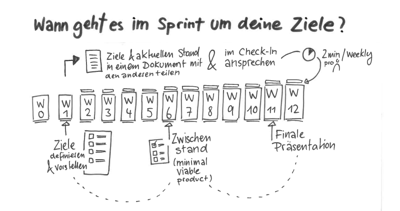

\newpage

# Der Sketchnote Lernpfad

Wenn du dich 12 Wochen mit einem Thema beschäftigst, ist das gleichzeitig sehr viel und sehr wenig Zeit. Die Katas (Übungen) in diesem Leitfaden sollen dir dabei helfen, das Beste aus dir und deinem Circle herauszuholen. Sie sind so aufgebaut, dass sie sowohl für Anfänger\*innen als auch für Fortgeschrittene geeignet sind. Nimm dir vor Start des Sprints Zeit, den Aufbau und die einzelnen Katas genauer anzuschauen. Manchmal gibt es mehrere Katas in einer Woche, sucht euch eine aus, oder macht beide, je nach Lust und Laune. Es gibt keine Kata-Polizei: Tauscht gerne Katas aus oder modifiziert sie, damit sie besser zu euren Zielen passen. Vielleicht schaut ihr auch einfach mal in den anderen [lernOS Lernpfaden](https://github.com/cogneon/), welche Katas dort genutzt werden und ob diese nicht besser für euch sind...

**Wie ist dieser Lernpfad aufgebaut?**

Lass uns das aus zwei Perspektiven betrachten. Zuerst schauen wir, wann deine individuellen Ziele im Laufe der zwölf Wochen Thema im Circle sind. Dann schauen wir uns an, nach welchem System die Katas aufgebaut sind.

{#small .center height=250}

Sketchnoten ist für jeden etwas anderes und wird auch für dich, je nach Situation, immer anders sein. Trotzdem gibt es grundlegende Qualitäten, die eine Sketchnote auszeichnen, die du dir nach Jahren noch gerne anschaust und die z. B. auch für deine Kolleg\*innen verständlich ist. Der Sketchnoter Mauro Toselli, den wir oben schon erwähnt haben, hat sich jahrelang mit diesen Qualitäten beschäftigt. Wir haben seine Einteilung der Qualitäten einer Sketchnote übernommen und die Katas auf ihnen aufgebaut. 

{#small .center height=250}

## Wie finde ich weitere Circle Member?

Du willst jetzt loslegen, aber weißt nicht so genau, wo die anderen Circle Member herkommen sollen? 

Wenn du dich in Sozialen Netzwerken, wie Facebook, Instagram oder Twitter bewegst, dann frag dort in einem Post nach weiteren Interessierten. Nutze dafür auch die die Hashtags  #lernOS und #sketchnoting. Du kannst die Autor\*innen des Lernpfades taggen, so kann dein Post einfacher gesehen und weitergeleitet werden. 

## Circle Organisator\*innen Checkliste

**#ProTipp:** in vielen Fällen ist die Zeit für das Ausführen der Übungen im Weekly zu kurz. Wir nutzen [daher die Flipped Classroom](https://en.wikipedia.org/wiki/Flipped_classroom) Methode. Für jedes Weekly gibt es eine Kata, die jedes Circle-Mitglied als “Hausaufgabe” vorbereitet, so dass ihr im Weekly mehr Zeit habt, die Ergebnisse zu besprechen. Das wird begleitet durch Leitfragen, die ihr gerne ergänzen könnt, und immer wieder gibt es auch Katas, die ihr gemeinsam während des Weeklys absolviert.

Du wählst deinen eigenen Schwerpunkt für den Sprint – was willst du neu lernen oder vertiefen? Wo stehst du? Was ist herausfordernd? Was ist jetzt gerade dran, wie geht es dann weiter – was wäre eher ein Schwerpunkt für einen weiteren Sprint? „Alles auf einmal und dann perfekt“ (und Überforderung / Frust) oder lieber doch „practice makes progress“ (Brandy Agerbeck) – Übung macht Fortschritte (und Spaß)?

{#small .center height=500}

Die hier aufgeführten Katas sind Vorschläge. Betrachte sie durch deine eigene Brille. Wenn verschiedene Katas zur Auswahl stehen – welche passt am besten zu deinem Schwerpunkt? Oder willst du alle machen? Wenn du selbst Ideen für Katas (oder Variationen) hast, die noch besser zu deinem Schwerpunkt passen, nutze diese! Und wenn du die dann mit uns teilst oder den Lernpfad selbst ergänzt, hilfst du allen anderen, die nach dir dem Lernpfad folgen! (... und verdient natürlich einen Haufen Karma-Punkte!)

Auf den nächsten Seiten findest du den Ablaufplan für den Sprint in Kurzform. Die Erklärungen für die einzelnen Katas und Warm-Ups folgen dann auf den Seiten danach.