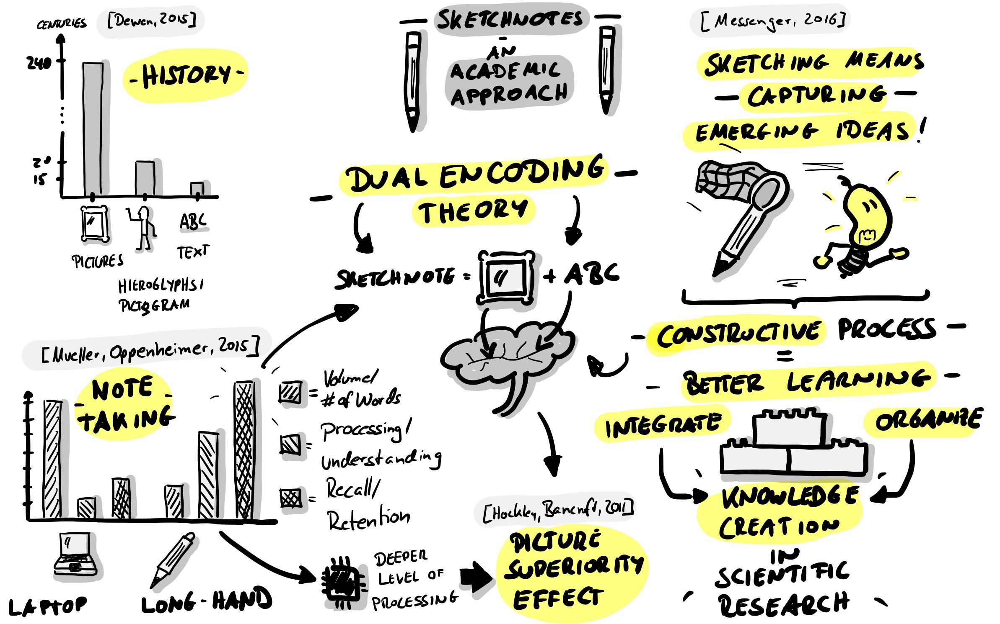
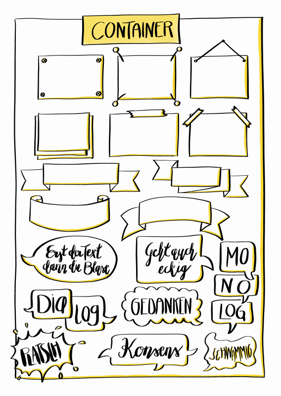
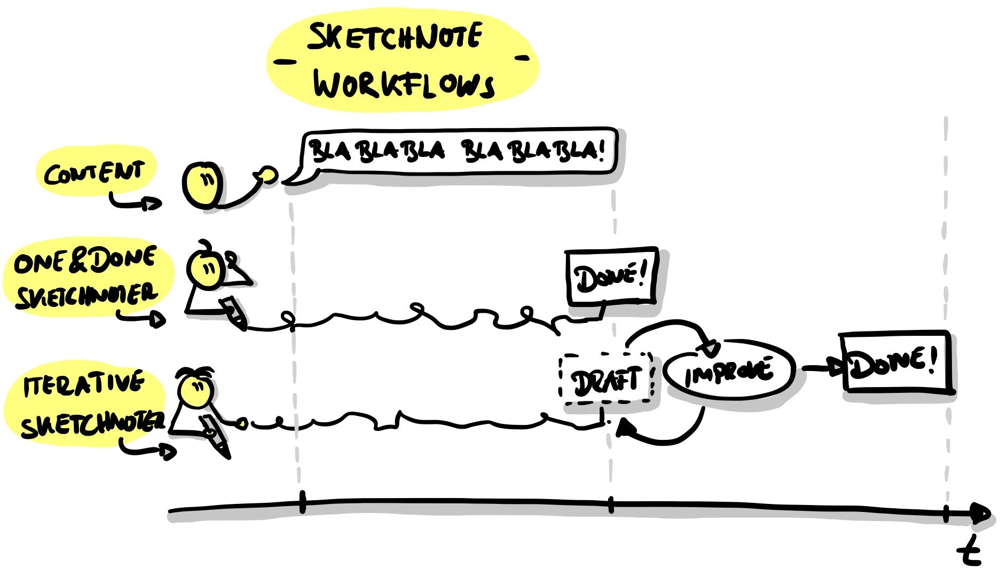
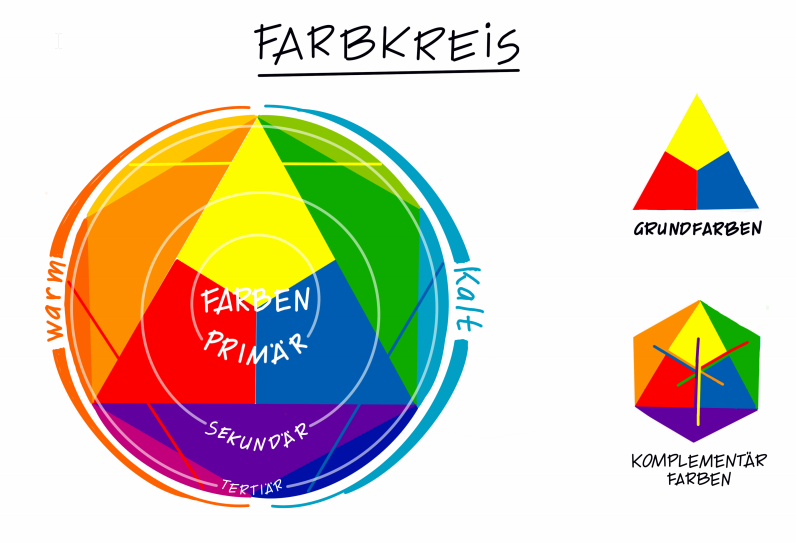

# Preface

The verb "lernos" is the future tense of "learning" in the Esperanto language (mi lernos = I will learn, ni lernos = we will learn). **lernOS** is an **operating system** for **lifelong learning** and **learning organizations**. But lernOS is not software, it's "brainware". It is a way to think and act to be successful in the 21st century as an individual, a team or a whole organization.

There are **three guides** that describe the approach on the **individual level** (lernOS for You), the **team level** (lernOS for Teams), and the **organizational level** (lernOS for Organizations).  Additionally there is the **lernOS Toolbox** describing commonly used methods and tools (e.g. Podcasting, Expert Debriefing, Barcamps, Sketchnoting). lernOS is not invented on the green field but a compilation of existing and tested methods. All guides are available under the **open Creative Commons Attribution (CC BY) license** on the [lernOS Website](https://lernos.org). 

If you have **further questions** regarding lernOS or need **peer support** you can freely join the community platform [CONNECT](https://community.cogneon.de) or write with [#lernOS](https://twitter.com/search?q=%23lernOS) on Twitter. The mastery of lernOS is a matter of months or years not hours or days. So **Keep Calm & Sketch On!** 

# Acknowledgments

Many thanks to Simon Dückert for the original lernOS, and his technical and moral support! This guide was written by: [Marjukka Zsagar-Renneberg](https://twitter.com/m4rjukka), [Raffaelina Rossetti](https://twitter.com/denkflowrr), [Benjamin Krüger](https://twitter.com/ben1kk), [Lars Bartschat](https://twitter.com/BartschatLars) und [Karl Damke](https://twitter.com/karlcdamke)

The authors have been massively supported by: 

- Natalia Zlateva (@nataliaoro on instagram): Kata "shopping list
- Mike Meister (@mm_mikemeister on Twitter): Warm Up "Scribble Birds", Warm Up "Visual Communication Makes the Difference".
- Sabine Erkens (@Sabine_Erkens on Twitter): Kata "Picture collection", Kata "#Never enough pens"
- Katrin Mäntele (@kleinerw4hnsinn on Twitter & Instagram): Kata "Feedback on Content", Warm Ups "Procedure" and "Figures in Action".
- Britta Ullrich (vizworks.de on the web & on Instagram): Kata "Soulshine Selfie"
- Conni Eybisch climp (@connieybisch on Instagram): Kata "Reflections
- Susanne Speer (@designpiranha on Twitter): Kata "Montagsmaler" (Monday painter)
- Simon Dückert (@simondueckert on Twitter): Katas taken from lernOS: "Circle Setup", "My goals for the next 12 weeks", "An appointment with yourself" and inspiration for the Kata "Top 5 resources". 

A big "thank you" for constructive feedback and improvements of the guide goes to: 

- Anke Stettner
- Katrin Coats
- Katja Klaußner
- Ralf Schramm
- Susanne Kitlinski
- Wibke Tiedmann
- Tobias Leisgang

# Introduction

To get the most out of this guide, you should know lernOS on which this guide is based. The most important thing in a sketch note:

If you want to know more, you can read all about lernOS [at Cogneon](https://cogneon.github.io/lernos-core/), download the guide or listen to [this podcast](https://colearn.de/clp066-aufzeichnung-cl-sprint-12-4-2019-die-kunst-des-selbstgesteuerten-lebenslangen-lernens/) with lernOS mastermind Simon Dückert. In the lernOS Sketchnote Guide we will refer to certain content from the lernOS Guide or further resources in some places. But don't stress yourself and concentrate on the contents and methods that are immediately important for you - so you still have something left for the next sprints. ;)  

**Why a Sketchnote Learning Path?

Of course, practice makes perfect and sketch notes are different for everyone.

But what always helps to get better is motivation, constructive feedback and access to good resources on the subject. Therefore we have developed the lernOS Sketchnote Learning Path. It contains 

a) an introduction to sketching & knowledge of material and basics (chapter 4) 

b) 23 Katas (exercises) on the most important areas of sketching (Chapter 5)

(c) to provide resources for learning, networking and inspiration

The learning path works for all "levels", no matter if you have been sketching for 5 minutes or 5 years. If you are at the very beginning, chapter 4 will surely help you to get started.

# Basics

No practice without a little theory. In the following chapter we will discuss the basics of sketching.

## What are sketch notes?

"*Sketch notes are visual notes consisting of a mixture of handwriting, drawings, hand-drawn typography, shapes, and graphic elements such as arrows, boxes & lines. "* *- Mike Rohde, author of the * [*Sketchnote Handbook*](http://rohdesign.com/) *and "inventor" of the term sketchnote.

*"Sketchnotes is scribbling while you take notes "* *- Kevin Thorn,* [*Nuggethead*](http://nuggethead.net/2013/01/what-are-sketch-notes/)

{#mid .center height=400}

Who hasn't painted, drawn and above all scribbled on all surfaces as a child? Doodling is a super-easy way to understand and share information. Sunni Brown describes this very impressively in her TED talk "[Doodlers, unite!](https://www.ted.com/talks/sunni_brown?share=11cb8401a9&language=en#t-29444)". In her book "The Doodle Revolution", Sunni shows how sketching information can motivate innovation and creative thinking by being succinct, concise and easy to understand.

Historically, we humans are visual beings. We have been using images for more than (20,000 years)[https://journal.lib.uoguelph.ca/index.php/perj/article/view/3137], the oldest cave paintings are even older. They are partly dated to more than (35.000 years)[https://de.wikipedia.org/wiki/H%C3%B6hlenmalerei].

From a scientific point of view, sketch notes are supported by the "[Dual Encoding Theory](https://en.wikipedia.org/wiki/Dual-coding_theory)". This theory describes that information that is encoded and stored twice, i.e. in our case as text and image, is more strongly anchored. They can later be remembered more quickly and accurately than "simple" text notes. The use of pen and paper, or even digital stylus and tablet, has immense advantages over, for example, typing on a laptop in a lecture or a meeting. (see article by [Oppenheimer and Mueller](https://journals.sagepub.com/doi/10.1177/0956797614524581)) The Sketchnoter's deep understanding of concepts and ideas is therefore much easier and quicker to grasp than the "clerk" who puts everything down on paper word for word or hacks it into his notebook.

Perhaps this is because when scribbling and sketching, a constructive process takes place in the brain. We have to assemble the various elements like Lego bricks and integrate and organize our knowledge so that there is no total chaos on the paper. As Hazel Messenger further writes in her article "[Drawing Out Ideas](http://creativeapproachestoresearch.net/wp-content/uploads/CAR9_1_Messenger.pdf)", the connection of feeling, feeling, thinking and doing also generates new knowledge, i.e. is constructed from all these components. 

Simply to the point: Images, especially in combination with text, are simply superior to pure text. Literature speaks of the [Picture Superiority Effect](https://psycnet.apa.org/record/2011-13423-001). 

If this is too complex and text-heavy for you, we have created a sketch note for you: 

{#mid .center height=500}

## What can I do with sketch notes?

You can sketch practically anything. Here are just a few examples:

- Recipes
- lawsuits
- organizations
- tales
- marketing plans
- business models
- university lectures
- maths lesson
- Sermons in the Church
- relationship maps
- plays
- book contents

So you can do sketch notes:

- Sketch solutions to problems
- Find ideas
- tell stories
- accumulate wealth (perhaps...)
- have fun
- Improve collaboration
- Sharing knowledge with other people!
- Creating participation and understanding
- dismantle barriers

## What do I need for sketching?

It all sounds nice, but what do I need to start with the sketching? Isn't it all totally complicated? Fortunately not! The only thing you really need is a pen and a pad on which you can sketch notes, that can be a pad, a notebook, a napkin or the famous beer mat. Of course, you can also digitally sketch notes on your tablet.

### Sketch notes with pen and paper

Pen and paper sketch notes are the "original" type of visual notes. This "analogue" approach has many advantages. Some are very subjective, it is best to form your own opinion:

- Your paper doesn't have a battery, which is empty exactly when you want sketch notes ...
- Pen and paper don't constantly send you notifications and distract you with your Insta feed ...
- If your notebook gets wet, you can dry it and it will probably still be legible afterwards. Throw your tablet into the bathtub ...
- Writing and drawing on paper just feels "right" ...
- Pen and paper have a very intuitive user interface
- In a digital age you are almost a rebel with pen and paper ...
- You can put a sketch note on paper in someone's hand, you can touch it and experience it haptically. 
- A sheet of paper has limits - with time you learn through this limitation to focus on the essential, the core messages!
- Pen and paper are the cheapest way to sketch notes!

Of course each medal has two sides, a few things pen and paper can't do so well:

- To share an analog sketch note online, you first have to scan or photograph it (the apps [CamScanner](https://play.google.com/store/apps/details?id=com.intsig.camscanner&hl=de), [Office Lens](https://play.google.com/store/apps/details?id=com.microsoft.office.officelens&hl=de) or [Adobe Scan](https://apps.apple.com/de/app/adobe-scan-dokumenten-scanner/id1199564834)) are very useful here, by the way.
- Copy and Paste or Cut and Paste are basically possible with paper, but very expensive!
- Corrections are not so easy or "disturb" the overall picture.
- Enlarging and reducing elements is also not really possible ...
- A leaf has limits - "Full is full", you can't extend analog sketch notes at will. (Except with enough tape...) 

Even if many websites tell you something different, you don't need special paper or expensive notebooks, nor are expensive pens necessary. To start, simply take a piece of paper from the printer and the first pen on your desk.

#### Paper and pen recommendations

You can find an extensive list on the [Sketchnote Hangouts] website (https://sketchnotehangout.com/resources/). 

We have decided not to list brands and products here. We think Sketchnote doesn't need expensive pens and special notebooks. The simplest promotional gift pen and a back of a failed printout are perfect. 

A "too beautiful" sketchbook is sometimes just that, too beautiful. You don't dare to start, out of concern to "ruin" the beauty. So: [KISS - Keep it simple, stupid!](https://de.wikipedia.org/wiki/KISS-Prinzip)

### Digital Sketch Notes

Meanwhile you can also do super digital sketch notes. A tablet computer is usually recommended for this, most smartphones are still too small. (A Samsung Galaxy note might be enough, as Opels Art [here](https://www.youtube.com/watch?v=Lai-GBlRq9Y) shows...) Most tablets are somewhat more comfortable, such as the Apple iPad (Pro), the Samsung Galaxy Tab or the Microsoft Surface series.

The digital sketch note has some immense advantages:

- You can (depending on the app) easily move, zoom in and out, cut and copy elements.
- Online sharing is built in...
- Your sketch notes are stored in a file system and maybe even searchable...
- Some apps offer you unlimited space for sketching notes (e.g. the "unlimited canvas" in the Concepts app), if you can think of some important points, you can add them at any time.

Like pen and paper, the sketch note on the tablet has a few disadvantages:

- With an empty battery you really look into the tube.
- Don't let the tablet fall, either in the bathtub or on the floor!
- Such a tablet with a stylus (pen) is not really cheap...
- Writing and drawing on glass feels strange, at least at the beginning. **#ProTipp:** A matt screen protection film creates a rougher surface. Many DigiSketchnotters like this somewhat paper-like writing feel. 
- You need to know your app very well if you want to have fluid sketch notes. 
- Many options and possibilities can distract you, as well as notifications about new mails, Twitter-DMs or Insta-Likes...
- Unlimited drawing space can also be overwhelming and you want to include even the smallest dot in your sketch note. Sometimes less is simply more...

Apps for sketching: 

- [ProCreate](https://procreate.art/) - fee required, for iOS
- [Paper by WeTransfer](https://paper.bywetransfer.com/) (formerly by 53) - Free basic version, subscription model, for iOS
- [Concepts](https://concepts.app/) - Basic version free of charge, for iOS, Android, Windows
- Tayasui Sketches - Basic version for free, for [iOS](https://apps.apple.com/de/app/tayasui-sketches/id641900855), [Android](https://play.google.com/store/apps/details?id=com.tayasui.sketches.lite&hl=en)
- [GoodNotes 5](https://www.goodnotes.com/) - chargeable, for IOS 

## Sketchnote Elements

No matter what the theme, you'll always use the same elements for your sketch notes. If you want to train them fundamentally, or need some inspiration and variety, we recommend "Sketch it - Das Kartenspiel" by Wibke Tiedmann and Stefanie Maurer, which you can [download here](https://sketchnotegame.wordpress.com/download-kartenspiel/) and use under CC BY SA 4.0.  All the following examples for the Sketchnote elements are from this game.

*"*[*Sketch it - Das Kartenspiel*](https://sketchnotegame.wordpress.com/download-kartenspiel/)*" by*[ *Wibke Tiedmann & Stefanie Maurer*](https://sketchnotegame.wordpress.com/ueber/)*, License:*[ *CC BY-SA 4.0*](https://creativecommons.org/licenses/by-sa/4.0/deed.de).

### Container

A container structures a sketch note by providing a frame for other elements.

{#small .left height=250 align=left}

### Disconnector

The separator ensures that the elements of a sketch note are clearly separated from each other, creating order and clarity.

{#small .right height=250 align=right}

### Text

Your sketch note consists of text and graphic elements, and the text can take on a variety of shapes and colors.

{#small .left height=250 float=left}

### Symbols and icons

Symbols and icons can be used in different ways for sketching. For example, you can create your own icon set to identify recurring elements. A classic is the light bulb for an idea or the exclamation mark for something that is particularly important.

{#small .right height=250 float=right}

### Connectors and arrows

Connectors and arrows are strong structural elements in sketch marking. They create the flow that the eye of the beholder follows. They show which part follows which part, for example, in a temporal or logical sequence. Connectors and arrows hold your sketch note together. They are the natural counterpart to the separator. 

{#small .left height=250 float=left}

### Figures

The figures are the actors on your sketch notes. They can be used to represent actions and emotions of individuals, teams or groups in different situations. It may be helpful to add faces or facial expressions to represent emotions, but we also express a lot of our feelings and emotions through our posture. Whether you give the characters a face or not depends almost entirely on your personal taste. 

{#small .left height=250 float=left}

### Diagrams

With diagrams you can visualize super data in your Sketchnote. Often programs like Excel are a little "too much". With a little practice you can create simple but very effective diagrams from elements like bars, lines and circles. A very impressive example for analog data visualization is the project "[Dear Data](http://www.dear-data.com/theproject)" by Giorgia Lupi and Stefanie Posavec, who sent each other postcards with hand-drawn visualizations for over a year.

## Sketchnote Workflows

{#mid .center height=300}

### "One and Done" and iterative sketch notes

A "One and Done" sketcher creates its sketch note, for example, during a talk at a conference or during a meeting. "One and Done" means that the Sketchnote is finished as soon as the event is finished. Maybe the last thing to do is to correct or add one or two small details, but "One and Done" is live.

In iterative sketching, you work in several, usually two, steps. During the event, you create a rough draft version of your sketch note, which is then revised and finalized after the event. This allows you to work in more detail and accuracy than with the "One and Done" approach, but it also takes much more time to complete the final product.

An even deeper process is described by Mauro Toselli, known as [@xLontrax](https://twitter.com/xlontrax), in his book "[The xLontrax Theory of the Sketchnote](https://www.maurotoselli.com/the-xlontrax-theory-of-sketchnote.html)":

- Mauro collects the material and creates the first sketch note
- Then it leaves it until the next session and "matures".
- The sketch note is then examined in detail,
- before everything superfluous is removed

Mauro defines the Eraser Critical Point, which he defines as "the number of elements you need to remove from your sketch note to compromise its meaning. Thus, his approach ensures that a Sketchnote has exactly the right number of elements to convey the desired content. According to his experience, this complex process is automated during sketching with skilled "One and Done" sketchers.

Which workflow is the right one? That depends on many things:

- What kind of guy are you?
- What fits the current situation?
- How much time do you have?
- How would you like to use your Sketchnote afterwards?

There is no right or wrong here, Sketchnote as you need it! 

Mauro has sketched a summary especially for this learning path: 

{#small .center height=500}

\newpage

# The Sketchnote Learning Path

If you spend 12 weeks dealing with a topic, it is both very much and very little time. The Katas (exercises) in this guide are designed to help you get the most out of yourself and your circle. They are designed to be suitable for both beginners and advanced users. Before starting the sprint, take your time to take a closer look at the structure and the individual katas. Sometimes there are several katas in a week, choose one or both, depending on your mood. There is no kata police: like to swap kata or modify them to fit your goals better. You might also want to check out the other [lernOS learning paths] (https://github.com/cogneon/) to see which Katas are used there and if they are better for you...

**How is this learning path structured?**

Let's look at this from two perspectives. First, we look at when your individual goals are in the circle over the twelve weeks. Then we look at the system according to which the Katas are structured.

{#small .center height=250}

Sketch notes are something different for everyone and will always be different for you, depending on the situation. Nevertheless, there are basic qualities that characterize a sketch mark that you still like to look at after years and that is also understandable for your colleagues, for example. Sketchnoter Mauro Toselli, whom we mentioned above, has been working on these qualities for years. We adopted his classification of the qualities of a sketch mark and built the katas on them. 

{#small .center height=250}

## Circle Organizers Checklist

**#ProTip:** In many cases the time for doing the exercises in the Weekly is too short. We use [therefore the Flipped Classroom](https://en.wikipedia.org/wiki/Flipped_classroom) method. For each weekly there is a kata that each Circle member prepares as a "homework" so that you have more time in the weekly to discuss the results. This is accompanied by guiding questions, which you are welcome to add, and there are always Katas, which you complete together during the Weekly.

You choose your own focus for the sprint - what do you want to learn or deepen? Where do you stand? What is challenging? What's on it right now, what's next - what would be more of a focus for another sprint? "Everything at once and then perfect" (and excessive demands / frustration) or rather "practice makes progress" (Brandy Agerbeck) - practice makes progress (and fun)?

{#small .center height=500}

The Katas listed here are suggestions. Look at them through your own glasses. If there are different katas to choose from - which one suits your focus best? Or do you all want to do it? If you have ideas for katas (or variations) that fit your focus even better, use them! And if you then share them with us or complete the learning path yourself, you will help everyone else who follows the learning path after you! (... and of course earns a lot of Karma points!)

On the following pages you'll find a short schedule for the sprint. The explanations for the single Katas and Warm-Ups will follow on the following pages.

**How is this learning path structured?**

Let's look at this from two perspectives. First, we look at when your individual goals are in the circle over the twelve weeks. Then we look at the system according to which the Katas are structured.

{#small .center height=250}

Sketch notes are something different for everyone and will always be different for you, depending on the situation. Nevertheless, there are basic qualities that characterize a sketch mark that you still like to look at after years and that is also understandable for your colleagues, for example. Sketchnoter Mauro Toselli, whom we mentioned above, has been working on these qualities for years. We adopted his classification of the qualities of a sketch mark and built the katas on them. 

{#small .center height=250}

## Circle Organizers Checklist

**#ProTip:** In many cases the time for doing the exercises in the Weekly is too short. We use [therefore the Flipped Classroom](https://en.wikipedia.org/wiki/Flipped_classroom) method. For each weekly there is a kata that each Circle member prepares as a "homework" so that you have more time in the weekly to discuss the results. This is accompanied by guiding questions, which you are welcome to add, and there are always Katas, which you complete together during the Weekly.

You choose your own focus for the sprint - what do you want to learn or deepen? Where do you stand? What is challenging? What's on it right now, what's next - what would be more of a focus for another sprint? "Everything at once and then perfect" (and excessive demands / frustration) or rather "practice makes progress" (Brandy Agerbeck) - practice makes progress (and fun)?

{#small .center height=500}

The Katas listed here are suggestions. Look at them through your own glasses. If there are different katas to choose from - which one suits your focus best? Or do you all want to do it? If you have ideas for katas (or variations) that fit your focus even better, use them! And if you then share them with us or complete the learning path yourself, you will help everyone else who follows the learning path after you! (... and of course earns a lot of Karma points!)

On the following pages you'll find a short schedule for the sprint. The explanations for the single Katas and Warm-Ups will follow on the following pages.

## Week 0: Planning the sprint and making arrangements

Before you start, invest some time to get to know each other and to discuss the conditions for your sprint.

**As preparation**

- [ ] Kata 1: Sketchnote-Selfie

**In the weekly**

- [ ] Check in (2 minutes per member)

- [ ] Warm Up: Curly birds (5 minutes)

Who are you? Introduce yourself. Here, of course, you should proceed on the basis of your Sketchnote-Selfie.  (5 minutes per member)

**guiding questions**:

- Would you rather work digitally or analogue?

- Do you use sketch notes more privately or professionally?

- How long have you been making sketch notes?

- What are your favorite materials (paper, pens, programs)? 

- [ ] Kata 2: Circle Setup (20 minutes)

- [ ] Kata 3: Feedback (10 minutes)

- [ ] Check Out (1 minute per member)

## Week 1: Set goals

This week, you choose your destination for the sprint. 

**As preparation**

- [ ] Kata 4: My goal for the next 12 weeks

- [ ] Kata 5: An appointment with yourself

**In the weekly**

- [ ] Check in (2 minutes per member)

- [ ] Warm Up: Targets (5 minutes) 

How do you visualize goals? Draw icons and compare them with each other. How do you visualize that the goals have been reached? 

**Exchange: Your goals in the sprint (10 minutes per member)**

- [ ] Share your goals from Kata 4.

**Guiding questions:

- Why are you doing this?  

- What inspires you about it?

- What does it mean to you to have achieved a goal?

- How did you make your goals quantitatively measurable according to OKR?

- How do you celebrate when you have reached your goal?

**Exchange: an appointment with yourself (5 minutes)**

- [ ] Have you all made an appointment with yourself in the calendar? What helped you?

- [ ] Check-Out (1 minute per member)

## Week 2: Font & Readability

Week 2 is about the written word: How does it best support the message of your sketch mark and how do you get there?

**As preparation**

- [ ] Kata 6: Letter your favorite saying

- [ ] Kata 7: Take your time writing 

**In the weekly**

- [ ] Check in (2 minutes per member)

- [ ] Warm Up: Very big and very small. 

- [ ] Feedback, exchange and tips on the Katas (40 minutes)

**guiding questions**:

- How do you use different scripts?

## Week 3: Visual vocabulary

Each language consists of individual elements: Develop the picture elements that best match your language and find your style.

**As preparation**

- [ ] Kata 8: Shopping list

- [ ] Kata 9: Picture collection

**In the weekly**

- [ ] Check in (2 minutes per member)

- [ ] Warm Up: Icons 

- [ ] Everyone brings along a term that they find exciting or difficult to visualize. All terms are chained in 30 seconds and then compared. (5 minutes)

- [ ] Exchange about the Kata(s) (40 minutes)

**guiding questions**: 

- How good is your visual vocabulary? 

- How do you collect/document your icons?

- What methods do you use to make them always tangible?

- Do you want to keep collecting icons and how do you want to share them? 

- Which icons are your top 5 icons that you use again and again in sketch notes?

- How satisfied are you with them? 

- Can you do anything to improve them? 

- Sketch the icon you want to improve and ask the others.

- [ ] Check out (1 minute per member)

## week 4: structure by pencils and color

This week you will discover the world of colours and stroke widths and how to add them to your sketch notes.

**As preparation**

- [ ] Kata 10: What do colours mean to you?

- [ ] Kata 11: Never enough pens

**In the weekly**

- [ ] Check in (2 minutes per member)

- [ ] Warm Up: Less details please (5 minutes)

- [ ] Kata 12: 1 Sketch note 5 colors (20 minutes)

Prepare the kata and finish it together

- [ ] Exchange about the Katas (25 minutes)

**guiding questions**:

- Which colours match your themes?
- Do you change the colors depending on the topics?
- How do you create structure, even if you only have a few pens?

- [ ] Check Out (1 minute per member)

## Week 5: Structure through layout

Week 5 is all about order: Sort and group all used elements and combine them to a harmonious layout.

**As preparation**

- [ ] Kata 13: Layouts for sketch notes 

**In the weekly**

- [ ] Check in (2 minutes per member)

- [ ] Warm Up: Container (5 minutes)

Draws various containers and discusses what they are suitable for. (A cloud, for example, stands for an idea rather than a result/decision.)

- [ ] Kata 14: Videosketching (40 min)

- [ ] Check Out (1 minute per member)

## Week 6: Your intermediate score

Pit stop: Reflect on what you have achieved, present it to your Circle Members and give you feedback together. Get fit for the second half of the circle.

**As preparation**

- [ ] Prepare for your presentation at Weekly. 

**In the Weekly**

- [ ] Check in (2 minutes per member)

- [ ] Warm Up: Draw your counterpart (5 minutes)

- [ ] Kata 15: Present intermediate result (10 minutes per member)

- [ ] Check out (1 minute per member)

## Week 7: Comprehensibility

Do you hear me? This week you are testing whether your sketch notes convey the statements you intended.

**As preparation**

- [ ] Kata 16: Videosketching: Did you get it?

**In the weekly**

- [ ] Check in: (2 minutes per member)

- [ ] Warm Up: Draw Toast (5 minutes)

- [ ] Exchange about the Kata

**guiding questions**:

- What expectations did you have for the comprehensibility of your sketch mark?
- Were these fulfilled?
- How was the feedback regarding readability, layout, choice of words?
- What worked particularly well for you?
- What was particularly challenging for you? (e.g. speaking speed in the video, filtering important things, ...)
- What did you learn for your next sketch notes, what do you want to keep and what do you want to do differently?

- [ ] Check out (1 minute per member)

## Week 8: Sharing for Feedback

After we gave each other feedback in week 7, you are now ready to go public: Actively get feedback on the content of your sketch notes from people outside the circle.

**As preparation**

- [ ] Kata 17: Feedback on Content

**In the weekly**

- [ ] Check in (2 minutes per member)

- [ ] Warm Up: Schedule (Week 8)

- [ ] Exchange via Kata 16 (20 minutes)

**guiding questions**:

- Where and how did you share your sketch mark? 

- How comfortable/uncomfortable was it? 

- What kind of feedback did you get?

- How exactly do you ask for feedback?

- [ ] Kata 18: Top5 Resources (20 minutes)

- [ ] Check out (1 minute per member)

## Week 9: Deepening your own project 

Setting the course for the final spurt: Develop your own project further or deepen what you have learned so far - use the feedback to develop yourself further.

**As preparation**

Decide what you want to focus on: 

- [ ] If you are working on your own project in this sprint, which you would like to have completed by week 11, take some time now to work on it again and get feedback on it.

- If you don't have a specific project/product, use Katas 19 and 20/21 to reflect on the sprint and what you have learned so far.

- [ ] Kata 19: Soulshine-Selfie

- [ ] Kata 20: Reflections - Sketch note (Part 1) "Structural Thoughts" 

**In the weekly**

- [ ] Check in (2 minutes per member)

- [ ] Warm Up: visual communication makes the difference (5 min)

- [ ] Feedback on your projects, exchange about Kata 19 & 20 and free repetition

- [ ] Check out (1 minute per member)

## Week 10: Fun must be!

Or also: "Embarrass yourself daily" :-) - Try your hand at improvising and the spontaneous presentation of your associations.

**As preparation**

- [ ] Think of terms for Kata 22: Monday painter 

- [ ] Kata 21: Reflection Sketchnote (Part 2) "The Structured Path" 

**In the weekly**

- [ ] Check in (2 minutes per member)

- [ ] Warm Up: Figures in action (5 minutes)

- [ ] Exchange about Kata 21

- [ ] Kata 22: Monday painter (25 min)

- [ ] Check out (1 minute per member)

## Week 11: Final Products and Lessons Learned

You get to be proud, too: Show your Circle Member what you have achieved and gained in knowledge (also about yourself).

**As preparation**

- [ ] Kata 23: Miss & show your success 

**In the weekly**

- [ ] Check in (2 minutes per member)

- [ ] Presentations (10 minutes per member)

- [ ] Check out (1 minute per member)

## Week 12: Reflection and conclusion

You have set off: But have you already reached your destination? What's the next step? Have you found your passion? Is after the circle before the circle? And when are we going to celebrate?

**As preparation**

- [ ] What's the next step? What are you going to do next? 

**In the Weekly**

- [ ] Check in (2 minutes per member)

- [ ] Warm Up: Special Features (5 minutes)

This week there is no clearly defined program with further exercises. You already presented the results of your work in week 11 - now is the time to finish the sprint together.

Talk about the Circle and your experiences in the last weeks. What you have learned and what the learning path has done with you. Maybe you already have ideas about what you want to do next. If not, be inspired by the others. Discuss what you want to do with the weeks after the sprint, because it is important to stay tuned so that the skills and positive habits you have built up in the sprint can be further consolidated. How about a new iteration of the Sketchnote learning path with new goals and focus?

- [ ] You've done a great job over the last few weeks - you should definitely celebrate that this week. 

- [ ] Check out (1 minute per member)

\newpage

# **Kata-Log**

## Kata1: Sketchnote-Selfie

To introduce yourself to others in your circle, draw a sketch note about yourself. Include the most important facts about yourself, mention things you (don't) like, two facts about yourself that aren't obvious, and a handy Sketchnote tip. Also try to answer the question why you visualize. When you're done, share your Sketchnote self with the others.

Example of a Sketchnote-Selfie at the start of a LernOS Circle on the topic "SketchnoteOutLoud":

{#mid .center height=300}

## Kata 2: Circle Setup 

If you don't know each other in the circle yet, get to know each other in week 0. Plan when you meet, what tools you use and who the moderator is.

Define a Circle Moderator to take care of event and time management. One of the biggest obstacles to successful Circle is discipline and time management. The moderator is not the "boss" of the Circle, but a normal Circle member who takes care of a smooth process. Defines the day and time of the weekly meeting. Defines whether you meet in person or virtually. Define the tools you use for communication and documentation in the circle. Decide which of the suggested exercises you want to do in the circle. 

- Circle Moderator: ...
- Day and time of the weekly: ...
- Weekly meetings are: personal / virtual
- Used tools (can all use them?): ...

## Kata 3: Feedback !

{#mid .center height=400}

A very important function of the circle is to get feedback on your goals and sketch notes and to give feedback to the others. To help you understand each other better, take a moment to talk about your idea of constructive feedback. This includes the question "Why do you visualise? and the principle "Compare yourself with yourself". 

**Further information:**

Brandyfesto: [Drawing as a thinking tool
](http://www.loosetooth.com/brandyfesto/index.htm)Video Doug Neill: [Sketchnoting is a superpower](https://www.youtube.com/watch?v=lQft0_nL9eI)

Video: Doug Neill: [How to critique your sketchnote](https://www.youtube.com/watch?v=BPHA2-uxBto)

## Kata 4: My goals for the next 4 weeks

What do you want to achieve in the next 12 weeks? Choose a goal that is really, really important to you and where you can make progress in sprinting. You will use Google's OKR method to define this goal. Especially for Sketchbook beginners, reaching your goal isn't a top priority.  In addition to learning the basic knowledge, such as acquiring your own visual ABC, the focus is of course especially on regular practice of the newly acquired skills and last but not least the main thing: have fun :-)

In order to achieve optimal learning success, it is nevertheless very important to set yourself goals that motivate you and with which you can make your progress tangible and visible. Think about whether you might want to work towards a specific product. This could be, for example, a Sketchnote Workshop for your colleagues*, or your first Graphic Recording, or, or, or, or...

Think about how you want to share your progress in your OKRs in the circle. Just checking in alone is a little bit less. Is there a way in your documentation tool to track your progress?

**Further information:**

- Wikipedia Article [SMART Criteria](https://en.wikipedia.org/wiki/SMART_criteria)
- WITH Sloan Articles [With Goals, FAST Beats SMART](https://sloanreview.mit.edu/article/with-goals-fast-beats-smart)
- Ted Talk [How We Can Make the World a Better Place by 2030](https://www.youtube.com/watch?v=o08ykAqLOxk)
- Video How Google Sets Goals: [OKRs with Google Ventures Partner Rick Klau](https://www.youtube.com/watch?v=mJB83EZtAjc)
- Book [Introduction To OKRs by Christina Wodtke](https://www.oreilly.com/business/free/files/introduction-to-okrs.pdf)
- Book [The Beginner's Guide To OKR by Felipe Castro](https://felipecastro.com/resource/The-Beginners-Guide-to-OKR.pdf)

## Kata 5: An appointment with yourself

Do you take enough time for your personal development and for working on your goals? Many people are busy with their daily tasks and do not care enough about their development and well-being. A good approach is to make an appointment with yourself and reserve this time in the calendar.

**Exercise (15 minutes):**

Check your calendar and look for possible appointments with yourself. One hour or even 30 minutes per week is a good starting point. Add an appointment with yourself to the calendar. If possible, make it a recurring appointment so that this time becomes a habit for you. Find at least five appointments:

1. …

2. …

3. …

4. …

5. …

Discuss your approaches in the Circle.

**Further information:**

- Video: [Big Rocks](https://www.youtube.com/watch?v=fmV0gXpXwDU)
- Podcast: [Never enoough time - Schedule your priorities by colorcoding your calendar](http://www.asianefficiency.com/schedule-management/color-code-your-calendar/)

## Kata 6: Letter your favorite saying 

A sketch note can be very well designed and structured with different fonts and sizes. But often we fall back into our habits when it comes to sketching and only use the same old letters.

Take a DIN-A5 sheet for this Kata and a not too long saying of your choice. Think about which words you want to write in which font and in which size. What is especially important, where does which emotion resonate? Perhaps you will first make a small pencil sketch for the proportions and then draw in cleanly. If you need inspiration for fonts, check out the corresponding cards in Sketchnote Game. 

**More information:** 

- Video: [How to Write Neatly + Improve Your Handwriting](https://www.youtube.com/watch?v=_QA_NScPlt8)
- Video: [How to Improve your Handwriting | For Note-Taking and Journaling](https://www.youtube.com/watch?v=1YXjAu9o11o)
- Video: [5 tips on how I improved my handwriting](https://www.youtube.com/watch?v=aK2SLQx6j9Q)

## Kata 7: Take your time writing 

A killer criterion for a good sketch mark is its readability. Especially if we often type too much on keyboards and don't write too much by hand in everyday life, the trained calligraphy from primary school is often only a pale memory.

In the appendix you will find an exercise sheet on "Architects Handwriting", which is known for its excellent legibility. If you often find it difficult to read your own handwriting, you might want to take some time to practice it regularly.

Another approach is to take a lot more time to write and see how this affects your readability. Write a short sentence in your normal handwriting and stop (approximately) the time. Then write the same sentence again, with twice as much time and maybe again, even slower. Look closely at the letters, what changes? Now gradually accelerate again and try to maintain the positive changes.

**More information:**

- Blogpost: [How to Write Like an Architect: Short Primers on Writing with the Neat, Clean Lines of a Designer](http://www.openculture.com/2018/02/how-to-write-like-an-architect-short-primers-on-writing-with-the-neat-clean-lines-of-a-designer.html)

## Kata 8: Shopping list

Create your shopping list with sketch notes instead of words. Practice different symbols for vegetables, fruits, animals, drinks, groceries, and drugstore items. After one month, look at your shopping list and create your own visual library for each of the 6 categories.

1 Shopping list - 10 minutes

Duration of the Kata - 1 month

Result - 6 categories for your visual library 

## Kata 9: Picture collection

Create an image library for your topics. Make a note of 10 keywords from your subject area. Now search your environment, books, pictures, and media for inspiration for your own presentation. Draw different variations or just one. Choose what suits you best. Save this in your collection.

Present your ideas in Weekly and discuss them in the group. Discuss where you found the best suggestions.

**More information:**

- Website: [The noun project](http://www.thenounproject.com) - free online database with picture symbols
- Video: Doug Neill: [How to expand your visual language - Build up from basic icons to more complex representations of ideas.](https://www.youtube.com/watch?v=z8UkHGpykYU)
- Website: John Atkinson - [Cartoons for Sketchnotes](https://wronghands1.com/)

## Kata 10: What do colours mean to you?

Colours transport emotions more directly than any layout. 
Answer the following questions for yourself.

- Which colours do you like?
- Which colors do you use for your sketch notes?
- Do you use the colors consistently?
- Which functions do colors fulfill for you?
- How can you use colors as code?

Share the results.

Are there differences in perception?

Does this change anything for you?

**More information:**

- Video Brandy Agerbeck: [The color spectrum](https://www.youtube.com/watch?v=s5h0wOtEWcg) 

{#mid .center height=300}

## Kata 11: #Never enough pins    

You can never have enough pens ;-) But for the beginning a black and a grey pencil and another colour is enough. Have a look at other sketch notes and plan for yourself which pens you need. With which pen thickness can you draw and write best? Which colors match your themes? Draw individual motifs with different pens and find your own style. Exchange ideas with each other:

- Where and how do you set shadows?
- How can color convey meaning?

## Kata 12: 1 Sketchnote 5 Colors

Prepare a sketch note in black. Make multiple copies and prepare your colored pencils. In Weekly you color your sketch notes together in different ways. 

**Suggestions for it:** 

- as always
- total opposite of the typical style
- after an emotion  
- extremely much colour
- Color only for one! Highlight
- Colour as a hierarchizing aid

## Kata 13: Layouts for sketch notes

**Preperation:**

\#View Cheat Sheet - think about which layout is suitable for which purpose

Which of these layouts do you already use?

Which layout have you always wanted to use?

Train your containers!

….

….

{#mid .center height=300}

## Kata 14: Videosketching

Agree on a video that you want to sketch together live. We recommend less than 10 minutes, maybe a show with the mouse. When you meet online, see if you can set up your cameras to show your sketch note.

**In the Weekly:**

Watch the video together and sketch the content. Then compare the sketch notes with each other. 

- Which layout did you choose and why?

- Were you able to do the layout as planned?
- Does the result correspond to your plan?
- Is the layout comprehensible for the others?
- What would you do differently next time?

Are you missing a layout idea on the cheat sheet?

**more information:**

Suggestion video to sketch live: [Julian Treasure - How to speak so others want to listen](https://www.ted.com/talks/julian_treasure_how_how_to_speak_so_that_people_want_to_listen?language=en)

## Kata 15: Present intermediate result

Bring your OKR metrics - if you want ;)

Do you make progress in your key results - how do the others rate that?

Where do you want to go?

If you are working on a specific product, you can use this Weekly to present your Minimal Viable product to others. 

For example, if you're not working on a product, you could do a rework of your Sketchnote self with the techniques you've been training over the past six weeks. 

Do you see any differences? 

Do the other Circle Members see differences? 

## Kata 16: Videosketching: Did you get it?

Divide into teams of 2. Both of you choose a short video on an interesting topic and sketch it (without telling what you sketch). Then share the result with your partner. This one first looks at the sketch note and then looks at the video. Prepare your feedback, either you make an individual appointment or you share your feedback in the circle.

**Key questions for analysis and feedback: **

- How legible is the sketch mark?

- How understandable is the sketch mark?

- How captivating do you find the Sketchnote?

- How informative is the Sketchnote?

- How is the Sketchnote structured?

## Kata 17: Feedback on content

For sketching notes, active listening and capturing the most important information (core theses), such as a lecture, is very important. 

Then why not approach the speakers and event organisers directly and ask them for feedback on the content of your sketch note? Has the information been captured completely? Are the core theses included?

At the end of a meeting, you could ask participants for feedback on your Sketch Mark. Do participants think you have captured the most important points from the meeting and weighted them accordingly?

If there are several sketch notes from different sketch notes in a lecture, you could compare the information content of the sketch notes and evaluate the information collected.

Share your experiences about ways to get feedback on the content of your sketch notes in your circle (20 minutes). Talk about your insights and reflect on how content feedback can help you improve your sketch mark skills.

## Kata 18: Top5 Resources

Maybe you've already had time to look at the resource list at the end of the guide. What did you like most? Are you missing something that inspired you or something that lets you see Sketchnoting from a completely different perspective? Write down a list of your Top5 and introduce your lists in Weekly. Find a way to make the lists available to each other.

## Kata 19: SoulshineSelfie

What are you personally grateful for that is in your life? It can be things, people, but also situations or special memories? Do you think often enough about the sunny side of life and the beautiful things? We all experience it far too often that we forget the happy moments far too quickly and concentrate only on our big and small problems.

**Exercise (30 minutes)**

Create a sketch note of all the things you like, love and simply value as part of your life. Draw yourself into the center, e.g. in front of a "sun" and arrange your "lucky ones" around it. Provide each of them with an over/underscore or a short text. Thus you profit from the "Dual-Encoding Theory" and anchor it deeper in your memory. 

Check out the [#SoulshineSelfie Posts](https://www.instagram.com/explore/tags/soulshinekalender/) on Instagram or the [related story](http://www.vizworks.de/soulshine-kalender/) for inspiration. 

## Kata 20: Reflections - Sketchnote (Part1) "Structure Thoughts

Step 1: Make three layout sketches for a sketch note that reflects your experience in this sprint.

Step 2: Choose a layout.

Step 3: Show your sketches in Weekly. Why did you choose which one?  

## Kata 21: Reflection Sketch Note (Part 2) "The Structured Path 

Draw the sketch note sketched in Kata 20 and share it with the others.

**Key questions for analysis and feedback: **

Repetition: Why exactly did you choose this structure? 

How did you try to create a readable, informative and appealing sketch note? Did you focus on something special?

What are your most valuable learning outcomes from this sprint?

How would you like to use these results? 

Was there a lernOS-AHA moment in this sprint? If so, what was it and why? 

## Kata 22: Monday painter

The Montagsmaler was a program in the German Vorabendprogramm, in which several
team members guessed terms drawn by a member of the team. For these
practice you need a few terms, which represent quite concrete things for the entrance as for the
Example train or elephant, so at first nouns outside of abstraction. As support for
the word finding can serve a thesaurus, which ejects words by random generator:

[https://www.palabrasaleatorias.com/zufallige-worter.php](https://www.palabrasaleatorias.com/zufallige-worter.php)

also available in English:

[https://www.palabrasaleatorias.com/random-words.php](https://www.palabrasaleatorias.com/random-words.php)

In turn, one member of the team picks a word and draws it, the others guess and find it.
find out what it is. The aim is to depict something graphically, the inhibition of drawing to
and, above all, to determine how little it often takes to achieve an unambiguity
to manufacture. This exercise is therefore particularly suitable for a "warm-up" after the first
Also in the later process this is a great setting of tasks, if the abilities
grow. Then verbs that show figures in action, such as running, also make sense,
dancing or thinking. 

## Kata 23: Miss & show your success 

Template in appendix: Spiderweb and OKR Tracking Graphic

**Warm-Ups**

## Curly birds (week 0)

Step 1: Scribble as many squiggles as possible on a sheet of paper within one minute.

Step 2: If you work in pairs: change your sheets, you are alone (in front of your screen), then continue with your own curls.

Take a second, different colored pencil and complete the curls with beaks, legs, wings, add shadows and shades if you want.

Step 3: Show your Kringle bird collection to the others. Maybe you'd like to share it later on Twitter or Instagram?

**More information:**

- Video: [Dave Gray - Squiggle birds](https://www.youtube.com/watch?v=vK3yQBouzNs)
- Video: [Hirameki - draw what you see](https://www.youtube.com/watch?v=IrLwkyWBB7w)

## Goals (week 1)

How do you visualize goals? Draw icons and compare them How do you visualize that the goals have been reached? 

## Very big and very small (week 2) 

Agree on a word. Everyone writes it with a thick pen, first very large and then very small. Then change the pen and write the word with a thin pen first very small and then very large. Compare the results with each other: How do you manage that everything is always readable and looks good?  (5 minutes)

## Icons (week 3)

Everyone brings along a term that they find exciting or difficult to visualize. All terms are chained in 30 seconds and then compared. (5 minutes)

*Variant 1: Then compare with #20secchallenge in Sketchnote Army Slack*

*Variation 2, make a mini story out of the 5 terms.

## Fewer details please (week 4)

Remember your favorite icon from last week together. 

Variant 1: All draw the icon in 30 seconds, then again in 15 seconds, then again in 5 seconds. Compare the results.

Variation 2: Draw the icon once with a normal pen and then with a much thicker pen. How do you manage to keep the icons visible?

## Container (week 5)

Draws various containers and discusses what they are suitable for. (A cloud, for example, stands for an idea rather than a result/decision.)

## Warm Up (week 6)

Pairs up and draw your counterpart (through the webcam) without looking at your sheet, and focus on essential features.
Time: 30 seconds
Variant 1: You can lift off the pen and put it back on.
Variation 2: Draw without lifting the pen off the sheet - with a line!

## Draw Toast (Week 7)

The exercise "[Draw Toast](https://www.drawtoast.com/)" was written by Tom Wujec, who calls it "Introduction to Systemic Thinking and Problem Solving". Here you use it as Warm Up for today's Weekly, so it is a bit shortened. The procedure is simple: 

1. get your pen and paper (digital is also possible, of course). 

2. draw a picture of how to make toast - in 3 minutes!

3. show each other your results, maybe you ask yourselves the following questions: 
    - Which picture/sketch note is simple, which complex?
    - Where do you see people, where not? 
    - What similarities and differences do you discover? 

If you like "Draw Toast", Tom has published it under CC-BY-SA at https://www.drawtoast.com/ You can open meetings and workshops by going through the whole process. Maybe you can also convince newcomers to sketch...

## Schedule (week 8)
Sketches the morning routine from the current morning (until you leave the house) or from the way to work.

## Visual communication makes the difference (week 9)

Step 1: One draws for himself a circle, a triangle and a square on a sheet of paper.  Without showing the picture to the others, he now explains his picture. The others draw the picture after his explanation. (In the first round no questions are allowed, communication only in one direction) Then all their pictures show up.

Step 2: Like step 1, now comprehension questions may be asked.

## Figures in action (week 10)

Draws different types of figures and shows them to each other.

Agree on 5 activities and draw your figures in action. Compare how you represented the activities!

More information:
[Sketchnote Game Chapter Figures](https://sketchnotegame.files.wordpress.com/2017/08/sketchnotes_a6-figuren.pdf)

## Emotions (week 11)

The characters continue - emotions can also be represented with them!

*Variant 1*: They all draw different emotions and express them through posture. Share your results and find out which emotion was represented.

*Variant 2*: Experiment with the face generator from the Sketchnote game and display different emotions through facial expressions!

More information:
[Sketchnote Game Chapter Figures](https://sketchnotegame.files.wordpress.com/2017/08/sketchnotes_a6-figuren.pdf)

## Special features (week 12)

Collects different eyes, noses, hairstyles, glasses, beards... and other characteristics (clothes, accessories). Share and compare your collections.

Play a round of Mensch-O-Mat or generate your own ingredients for bizarre characters!

More information:
The (Mensch-O-Mat)[https://www.ein-bild.com/menschomat] by Sandra Martin @SamHH generates the "ingredients" as a random recipe.

## More warm-ups to choose from

**Apples**
Draws as many terms as possible that contain the word "apple".
Or agree on another term.
More info:
According to https://www.tbd.community/de/a/3-kreativitaetsuebung-team

**Story Cubes**
If any of you have the Storycubes, use them to tell a short visual story.
Alternatively you can use the random word generator for multiple words or the one for single words (nouns)!
Or the app "Inspire me", a word generator where you can also create your own word lists. (Only for Apple devices).

**Circles**
Which pictorial symbols can you think of that contain the circle as the basic form? Draw them and compare your results!
Please use the A4 template PDF with 15 circles attached.

\newpage

# ¶¶Resources ¶¶

## Videos

**[Doodlers, unite!](https://www.ted.com/talks/sunni_brown?share=11cb8401a9&language=en)**

Studies show that sketching and drawing improves our understanding - and our creative thinking. Why are we still embarrassed when we get caught doodeling in a meeting? Sunni Brown says, "Doodlers, unite! She stands up for freeing your brain with paper and pen! (English)

**Karen Bosch - [Sketchnote elements](https://www.youtube.com/watch?v=sH-sJXMQjro&feature=share)**

Overview of the basic elements of a sketch note. (English)

**Kate Hayward - [Draw like a child, see like a master](https://www.youtube.com/watch?v=ZA92l6KwuT4)**

Draw like a child, see like a master. 

Hayward explains how seemingly simple drawing techniques can allow us to communicate more clearly by building an extensive visual vocabulary of simple, childlike images. (English)

**Brandy Agerbeck - [The essential 8](https://www.youtube.com/watch?v=3sXsXveYQtc)**

The thought of drawing in front of other people can be intimidating. Brandy Agerbeck breaks drawing down into 8 essential components in the context of Graphic Facilitation. All visual practitioners can use this video. It helps you to focus on the essentials and to get the ideas out of your head and onto paper. (English)

**Mike Rohde - [Sketchnote mini workshop](https://www.youtube.com/watch?v=39Xq4tSQ31A&feature=share)**

Half-hour sketch note workshop. (English)

**Heather Martinez - New Ground Hand 2.0 :: [Lettering Tips Tuesdays](https://www.youtube.com/watch?v=0O8PoYsxaT4)**

Neuland Hand 2.0 is a handwriting designed for graphic recorders and presenters that is good for titles and headlines. (English)

**[Verbal to Visual YouTube Channel](https://www.youtube.com/channel/UCuFm4ARxn306lX_OWMnz0-w)**

YouTube channel by Doug Neill / "Verbal to Visual" with lots of practical tips and instructions around learning and using sketch notes. (English)

**Pavo and Rob - [Coffee talk about sketching notes, lettering... YouTube channel](https://www.youtube.com/channel/UCY7b7ox2oKeFL61KNRQNGHw)** 

**Willemien Brand - [VISUAL THINKING](https://www.youtube.com/watch?v=pUelkBYu9jU)**

Visual thinking - integrating visualizations into business communication

Willemien presents a webinar in which she explains the meaning and purpose of visual thinking in a business context. Includes a short live business character workshop. (English)

**Onda - [Visual Thinking Crash Course!](https://www.youtube.com/watch?v=IdVBjZbqOSk)**

A crash course in visual thinking. (English)

**Scriberia - [What is visual thinking?](https://www.youtube.com/watch?v=rZikhQ5w5Ck)**

What is visual thinking? A small animation film. (English)

**Brandy Agerbeck - [what is visual thinking?](https://www.youtube.com/watch?v=Yr6DN20NHvs)**

What is visual thinking? No instruction video, more of a "why should I?" video - why drawing is such a fantastic thinking tool and why Brandy focuses on THINKing in visual thinking. (English)

**Graham Shaw - [Why people believe they can't draw - and how to prove they can](https://www.youtube.com/watch?v=7TXEZ4tP06c)**

Why do so many people think they can't draw? Where and when did we develop this conviction? Graham Shaw destroys this illusion in a very pragmatic way. He demonstrates impressively how the simple act of drawing has the power to bring about a positive change in our world!

## Books 

**Mike Rohde - The sketchnote handbook** - The classic! 

**Sunni Brown - The doodle revolution** - Unlock the power to think differently: Unlock the power to think differently - about the how and why of Doodles. (English)

**Dan Roam - The back of the napkin explained on the napkin** - With a few strokes quickly convince instead of long present. Solve problems and sell ideas with pictures - very tactical! (English/German)

**Dan Roam - Blah blah blah - What to do, when words don't work** - Tell exciting stories with illustrations. (English/German).

**Tanja Wehr - Die Sketchnote-Starthilfe** - Over 200 line by line instructions and fonts to trace (German).

**Tanja Wehr - Die Sketchnote-Starthilfe Neue Bilderwelten** - Comprehensive Business and Sketchnote picture vocabulary- Over 300 new picture vocabulary (German)

**Maja Larsson - Alla kan rita symboler** - In Swedish, but very lively and individual templates and inspirations for figures.

**Brandy Agerbeck - The idea shapers - The power of putting your thinking into your own hands** - The power to put your thinking into your own hands. Detailed basic work on drawing as a thinking tool. Very systematic, with 24 "idea shapers" / concepts to visually design ideas.

**Paintings by Tiesenhausen: Ad hoc visualization - Making thinking visible** - Practical instructions and tips for communicating your ideas more comprehensibly and sustainably through visualization and as resources in idea generation. (German)

**Brandy Agerbeck - The graphic facilitator's field guide/The Guide for the Graphic Facilitator** - How to create meaning by listening, thinking and drawing. Refers to Graphic Facilitation, Graphic Recording, Visual Moderation / Creating Visual Protocols. (English/German)

**Robert Klanten, Anna Leena Schiller, Sven Ehmann - Graphic recording: A guide to illustrating meetings, conferences and workshops** - A comprehensive manual with many examples of various graphic recordings. (German)

**Giorgia Lupi & Stefanie Posavec - Observe, collect, draw (data visualization)** - A visual "diary" with many suggestions for finding patterns in your daily life by observing, collecting and drawing (visualizing data). A very vivid, concrete and personal introduction to / experience with the visualization of data. (English)

## Communities

Sketchnote Army](https://sketchnotearmy.com/) [Slack channel](https://sketchnote-army.slack.com/join/shared_invite/enQtMzkwNDQ5MDk5NjM2LTkxNDk0ODAyMDEzMDViNzM3Mzg4NWVjM2YxNTZlMjE3MmEzMTNkYTA0NzIzZmU2NzY3ZDBiMTc3MTNkMjljMTQ)

Sketchnotes Germany on [XING](https://www.xing.com/communities/groups/sketchnotes-germany-1094723) and [Facebook](https://www.facebook.com/groups/sketchnotesgermany/)

## Inspiring People / Newsletter / Social Media Accounts

Malte von Tiesenhausen - [Instagram](https://www.instagram.com/malte_von_tiesenhausen/)

Eva-Lotta Lamb - [Newsletter](https://sketchnotesbook.us2.list-manage.com/subscribe?u=6002ba391bca80877955f964d&id=2ba2f4f8a3), [Instagram](https://www.instagram.com/evalottchen/)

Tanja Weir - [Instagram](https://www.instagram.com/sketchnotelovers/)

Katja Reiter - [Instagram](https://www.instagram.com/katja.visualisiert/)

Austin Kleon - ([Newsletter](https://austinkleon.com/newsletter/))

Djangonaut [Instagram](https://www.instagram.com/djangonaut/) - Instagram Live Talk / Mo - Fr at 9:30 am (coffee talk with Pavo and Rob) Instagram [#pavoundrob](https://www.instagram.com/explore/tags/pavoundrob/) - Sketch notes on the Coffee talks

Nick Sousanis - [Twitter](https://twitter.com/Nsousanis)

Marcel van Hove - [Twitter](https://twitter.com/marcelvanhove)

Linda Saukka-Rauta - [Twitter](https://twitter.com/saurau)

Sunni Brown - [Twitter](https://twitter.com/SunniBrown)

Sandra Martin - [Twitter](https://twitter.com/sam_HH)

Ania Staskiewicz - [Twitter](https://twitter.com/AniaStaskiewicz)

The Little Insanity - [Twitter](https://twitter.com/kleinerW4hnsinn)

Karen Forkish - [Twitter](https://twitter.com/kforkish)

Ben Crothers - [Twitter](https://twitter.com/bencrothers)

Holger Nils Pohl - [Twitter](https://twitter.com/HolgerNilsPohl)

Marianne Rady - [Twitter](https://twitter.com/MarianneRady)

Brandy Agerbeck - [Twitter](https://twitter.com/loosetooth)

Gary Lau - [Twitter](https://twitter.com/PastorGaryLau)

Dr. Makayla Miranda Lewis - [Twitter](https://twitter.com/maccymacx)

Prof. Clayton - [Twitter](https://twitter.com/ProfClayton)

Diana Soriat - [Twitter](https://twitter.com/DianaSoriat)

Marc Bourguignon - [Twitter](https://twitter.com/100978Marc)

Doug Neill - [Twitter](https://twitter.com/douglaspneill)

Magic Le Gall - [Twitter](https://twitter.com/magalielegall)

Nadine Rossa - [Twitter](https://twitter.com/nadrosia)

Prof. Katharina Theis Bröhl - [Twitter](https://twitter.com/theiskbt)

Rob Dimeo - [Twitter](https://twitter.com/Rob_Dimeo)

Mauro Tosselli - [Twitter](https://twitter.com/xLontrax)

Sketchnote Army - [Twitter](https://twitter.com/SketchnoteArmy)

Katharina Blum - [Twitter](https://twitter.com/kuestenkonfetti)

# Stop talking, start doing!

If you have read this guide, but are not yet actively using lernOS, you should start now! Starting with lernOS is really easy. These five steps will help you get started smoothly:

1. schedule time: define the quarter in which you want to start with lernOS. Enter the times for the Weekly in the calendar. This regular date is especially important if you practice lernOS in a circle.

2. define goals and key results: use week 0 to set your goals and measurable results for the sprint. Choose a goal that is really, really close to your heart.

3. create a circle: look for 3-4 competitors who want to start a sprint in the same quarter. If someone has already been in another circle, they can take on the role of Circle Moderator.

Organize the Weekly: if you don't know each other in the Circle, meet in week 0 personally. Use social networks or messengers to communicate between meetings. Use video conferencing to organize virtual meetings.

5 Plan, Do, Learn, Repeat: Use the last weekly in week 12 to reflect on results and collaboration in the circle. Decide if you want to do another sprint together.

**Keep Calm & Sketch On!**

\newpage

# Change history
| Version | Edited by | Description Change | Date |
|---------|----------------|-----------------------|-------|
| 0.1 Benjamin Krüger Initial Commit. Texts and images are inserted, links formatted correctly. | 2019-06-19 |

