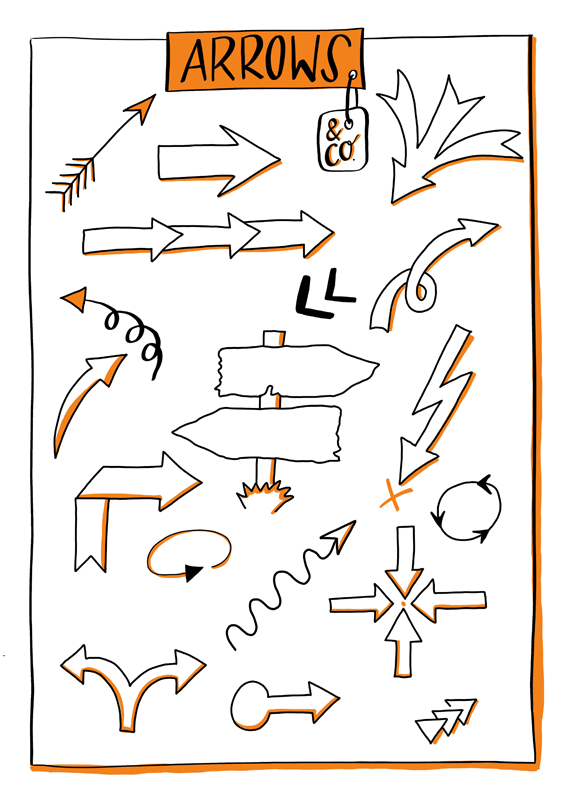

## Introduction

To make the best use of this guide, you should know something about lernOS, the foundation this guide is built upon. For this purpose, here is the most essential information in a sketchnote:

If you want to know more, you can read everything about lernOS at Cogneon, download the guide there or listen to [this podcast](https://colearn.de/clp066-aufzeichnung-cl-sprint-12-4-2019-die-kunst-des-selbstgesteuerten-lebenslangen-lernens/) with lernOS mastermind Simon Dückert. In the lernOS Sketchnote guide we will refer to specific contents of the lernOS guide or further resources. But don’t stress yourself and concentrate on the contents and methods that are directly crucial for you—so you still have something left for the next sprints ;)

**Why do I need a Learning Path for Sketchnoting?**

In the current [VUCA](https://en.wikipedia.org/wiki/Volatility,_uncertainty,_complexity_and_ambiguity)-world, sketchnotes can be a super useful tool that helps you structure and deeply understand information. But they can also help you learn new things, or support you and your team to get a common picture.

As with everything, the same applies to sketching: Practice makes perfect!
Motivation, constructive feedback and access to useful resources are the base for practice that is fun. And you’ll stick with it only if it's fun.

For this purpose, we have developed the lernOS sketchnote learning path. It contains: 

a) An introduction to sketching & knowledge about materials and basic  

b) 23 katas (exercises) for the essential parts of sketchnotes 

c) Resources for further learning, networking and inspiration

The learning path works for all "levels", whether you have been sketching for 5 minutes or 5 years. If you are at the very beginning, the following chapter will surely help you get started.

## What are Sketchnotes?

*"Sketchnotes are visual notes that consist of a mixture of handwriting, drawings, hand-drawn typography, shapes and graphic elements such as arrows, boxes & lines."* *- Mike Rohde, author of* [*The Sketchnote Handbook (Peachpit Press, 2013)*](http://rohdesign.com/) *and coiner of the term sketchnote.

*"Sketchnotes is scribbling while you take notes"* *- Kevin Thorn,* [*Nuggethead*](http://nuggethead.net/2013/01/what-are-sketch-notes/)

{#mid .center height=350}

Who didn't paint, draw and especially scribble on all surfaces as a child? Doodling is a super-easy way to understand and share information. In her TED Talk "[Doodlers, unite!](https://www.ted.com/talks/sunni_brown?share=11cb8401a9&language=en#t-29444)". In her book, "The Doodle Revolution," Sunni shows how strongly sketching information motivates innovation and creative thinking, by making it concise and easy to understand.

Historically, we humans are visual beings. We have been using images for more than [20,000 years](https://journal.lib.uoguelph.ca/index.php/perj/article/view/3137), and the oldest cave paintings are even older. As of publication, the  oldest are in the Maltravieso cave, Cáceres, Spain, dating back more than [64,000 years](https://en.wikipedia.org/wiki/Cave_painting).

From a scientific point of view, the "[Dual Encoding Theory](https://en.wikipedia.org/wiki/Dual-coding_theory)" supports sketches. This theory describes that information that is encoded and stored twice—in this case text and image —is more firmly anchored. It can be recalled more quickly and accurately than "simple" text notes. The use of pen and paper, or digital stylus and tablet, therefore has immense advantages over typing on a laptop in a lecture or meeting. (see the article by [Oppenheimer und Mueller](https://journals.sagepub.com/doi/10.1177/0956797614524581)) DThe sketchnoter's deep understanding of concepts and ideas is much faster and easier than that of the "co-writers," who put everything down on paper word-by-word or transcribe it to their notebook.

Maybe that's because scribbling and sketching is a constructive process in the brain. We have to assemble the different elements like LEGO bricks and integrate and organize our knowledge to avoid chaos on paper. As Hazel Messenger writes in her article "[Drawing Out Ideas](https://web.a.ebscohost.com/abstract?direct=true&profile=ehost&scope=site&authtype=crawler&jrnl=18359442&AN=120666112&h=j66cPhqDECmzFTzdusRYarMmVfAAlKKDXnRef90BzvF9NuVMYq8%2fTh%2fERMpVyXIr8FJNnm8i0T0Vhw%2fkJW0hZQ%3d%3d&crl=f&resultNs=AdminWebAuth&resultLocal=ErrCrlNotAuth&crlhashurl=login.aspx%3fdirect%3dtrue%26profile%3dehost%26scope%3dsite%26authtype%3dcrawler%26jrnl%3d18359442%26AN%3d120666112)" the combination of sensing, feeling, thinking and doing contributes simultaneously to sensemaking, i.e., it is constructed from all these building blocks.

In summary: images, especially in combination with text, are superior to plain text for sensemaking, recall, and attention. In literature, the term [Picture Superiority Effect](https://psycnet.apa.org/record/2011-13423-001) is used to explain this phenomenon.

If all this is too complex and text-heavy for you, we have created a sketchnote for you: 

{#mid .center height=350}

## What can I do with Sketchnotes?
You can sketchnote almost anything. Here are just a few examples:

- Recipes
- Processes
- Organizations
- Stories
- Marketing plans
- Business models
- University lectures
- Math lessons
- Church sermons 
- Relationship maps
- Stage plays
- Book contents

So you can use sketchnotes too:

- Deeply understand content
- Focus yourself
- Sketch solutions to problems
- Find ideas
- Tell stories
- Accumulate wealth (maybe...)
- Muck around
- Improve cooperation
- Share knowledge with other people!
- Create participation and understanding
- Dismantle barriers
- Amplify voices and ideas

## What do I need for sketchnoting?

You might think, "that all sounds very nice, but what do I need to start sketching? Isn't it all very complicated?" Good news—it's not. The only thing you actually need is a pen and some paper you can sketch on. It could be a pad, a notebook, a napkin or even a coaster. Of course, you can also digitally create sketchnotes on a tablet. We'll discuss each in turn below.

### Sketchnotes with pen and paper

Sketchnotes with pen and paper are the "original" way of making visual notes. This "analog" approach has many advantages. Some of them are very subjective. It is best to form your own opinion:

- Paper doesn't have a battery that gets exhausted just when you want to take sketchnotes.Pen and paper do not continuously distract you with notifications.
- If your notebook gets wet, you can dry it, and it will probably still be readable afterward. Throw your tablet in the bathtub, though…
- Writing and drawing on paper just feels "right".
- Pen and paper have a very intuitive user interface.
- In a digital age, you are almost a rebel with pen and paper.
- You can put a sketchnote on paper in someone's hand, and you can touch it and experience it haptically.
- A sheet of paper has limits. Through this limitation, you learn to focus on the essentials, the core messages over time!
- Pen and paper is the cheapest way to sketch! 

There are a few things that pen and paper are actually not so good at:

- To share an analog sketchnote online, you first have to scan or photograph it (the following apps are handy for this purpose: CamScanner, Office Lens, or Adobe Scan.)
- Copy and Paste or Cut and Paste are possible with paper, but they are very time-consuming!
- Corrections are not that easy. Potentially they "disturb" the overall picture.
- Enlarging and reducing elements is also not really possible ...
- A sheet has limits - "Full is full", you can't extend analog sketchnotes at will. (Except with plenty of tape...)

Even if many websites tell you otherwise, you don't need any special paper or especially expensive notebooks, nor do you need costly pens. To get started, just take a sheet of paper from the printer and the first available pen on your desk.

#### Paper and pen recommendations

You can find an extensive list on the [Sketchnote Hangouts](https://sketchnotehangout.com/resources/) website. 

We choose not to list brands and products here. We think sketchnotes don’t need expensive pens and fancy notebooks. The simplest schwag pens and the back of a failed print are fine. 

A "too beautiful" sketchbook is sometimes just that, too beautiful. You don't dare to start "ruining" beauty because you're afraid of it. So: [KISS - Keep it simple, stupid!](https://en.wikipedia.org/wiki/KISS_principle)

### Digital Sketchnotes

Meanwhile, you can also do kick-ass digital sketching. For this, a tablet computer is a typical recommendation, as most smartphones are still too small, although a Samsung Galaxy Note could be enough as Opels Art shows [here](https://www.youtube.com/watch?v=Lai-GBlRq9Y). Most tablets are a little more comfortable, such as the Apple iPad (Pro), the Samsung Galaxy Tab or the Microsoft Surface series.

Digital sketching has immense advantages:

- Some apps let you quickly move, zoom in and out, cut and copy elements.
- Online sharing is virtually built-in.
- Your sketchnotes are stored on a file system and may even be searchable.
- Some apps offer you unlimited space to sketch (e.g. the "unlimited canvas" in the Concepts app), if you think of any critical points later on, you can add them at any time.

Like pen and paper, sketchnoting on the tablet has a few disadvantages:

- With a dead battery, you're back in the dark ages.
- Don't drop the tablet. Neither in the bathtub nor on the floor!
- A tablet with a stylus (pen) is not cheap.
- Writing and drawing on glass feels strange, at least in the beginning.
 #ProTip: A matte screen protector creates a rougher surface. Many digi-sketchnoters like this slightly paper-like writing feeling.
- Your first sketchnotes with any app will be slow as you get used to its interface and feature set. You’ll need to build expertise to get fast.
- The operating system notifications can be very distracting as you sketchnote.
- Unlimited drawing space can be overwhelming, and you want to include every little dot in your sketch note. Sometimes less is just more.

Apps that can be used for sketchnoting:

- [ProCreate](https://procreate.art/) -  with costs, for iOS (Doug Neill presents[ProCreate as sketchnote tool](https://www.youtube.com/watch?v=jhd8WQ9cBww) in a video)
- [Paper by WeTransfer](https://paper.bywetransfer.com/) (formerly by 53) - Basic version free, subscription model, for iOS
- [Concepts](https://concepts.app/) - Basic version free, for iOS, Android, Windows
- [Tayasui Sketches](https://tayasui.com/sketches/) - Basic version free, for iOS, Android
- [GoodNotes 5](https://www.goodnotes.com/) - with costs, for iOS,

You can find a comparison of different apps at [Timo](https://sketchnoting.net/sketchnotes-apps/) and on [Pixpa](https://www.pixpa.com/blog/drawing-apps). 

## Sketchnote Elements

No matter what the theme is, you'll always use the same elements for your sketches. If you want to train in the fundamentals, or need some inspiration and variety, we recommend "Sketch it – The Card Game" by Wibke Tiedmann and Stefanie Maurer. You can download it  [here](https://sketchnotegame.wordpress.com/download-kartenspiel/)and use it under the Creative Commons Attribution-ShareAlike 4.0 International license. (CC BY SA 4.0). Following examples of Sketchnote elements originate from this game.

*„*[*Sketch it – Das Kartenspiel*](https://sketchnotegame.wordpress.com/download-kartenspiel/)*„ by*[ *Wibke Tiedmann & Stefanie Maurer*](https://sketchnotegame.wordpress.com/ueber/)*, Lizenz:*[ *CC BY-SA 4.0*](https://creativecommons.org/licenses/by-sa/4.0/deed.de).

### Container

A container structures a sketchnote by providing a frame for other elements.

{#small .left height=250 align=left}

### Separator

The separator ensures that the elements of a sketchnote are distinct from each other, thus creating order and clarity.

{#small .right height=250 align=right}

### Text

Your sketchnote consists of text and graphic elements, and the text elements can also take on different shapes and colors.

{#small .left height=250 float=left}

### Symbols and Icons
You can use symbols and icons in different ways when sketching. For example, you can create an personalized icon set for recurring concepts. A classic example is a glowing light bulb for an idea, or an exclamation mark for something important.

{#small .right height=250 float=right}

### Connectors and arrows

Connectors and arrows are strong structural elements in sketching. They create the flow that the eye of the observer follows. They show which part follows which, for example, in a temporal or logical sequence. Connectors and arrows hold your sketchnote together. They are the natural counterpart of the separator.

{#small .left height=250 float=left}

### Characters

The characters are the actors in your sketchnotes. They can be used to depict the actions and emotions of individuals but also of teams or groups in different situations. Adding faces or facial expressions can be helpful to show emotions. You can express a lot of feelings and emotions through the posture of characters as well. So whether you give the figures a face or not depends almost entirely on your style.

{#small .left height=250 float=left}

### Diagrams

Diagrams are well-suited to visualizing data in a sketchnote. With a bit of practice, you can create simple but powerful charts from elements like bars, lines and circles. An awe-inspiring example of analog data visualization is the project "[Dear Data](http://www.dear-data.com/theproject)" by Giorgia Lupi and Stefanie Posavec, who sent each other postcards with hand-drawn visualizations for over a year.

## Sketchnote Workflows

{#mid .center height=200}

### "One and done” vs. iterative Sketchnoting

"One and done" sketchnoters create sketchnotes during a conference talk or meeting. "One and done" means that you're done with the sketchnote as soon as the event is over. You might have to correct or add a few small details at the end, but "one and done" is "live".

Contrast this to iterative sketching, in which you work in several, but usually two, steps. During an event, an interative sketcnoter creates a rough draft version, which is then revised and finalized after the event. This allows you to work in more detail and accuracy than with the "one and done" approach, but can be tempting for the perfectionist to spend way much more time completing the final product.

Mauro Toselli, known as [@xLontrax](https://twitter.com/xlontrax), describes an even more in-depth process in his book "[The xLontrax Theory of the Sketchnote](https://www.maurotoselli.com/the-xlontrax-theory-of-sketchnote.html)":

- Mauro collects the material and creates the first sketchnote.
- Afterward, he leaves it to “mature” until the next session.
- He then examines the sketchnote in detail…
- …before removing anything superfluous.

Mauro defines the "Eraser Critical Point" for this. He describes it as "the number of elements you must remove from your sketchnote to compromise its meaning." So his approach ensures that a sketchnote has just the right number of elements to convey the desired content. In his experience, with skilled "one and done" sketch artists, this complex process is automated during the sketching process.

Which workflow is the right one? That depends on many things:

- What type of sketchnoter are you: One-and-done or iterative?
- What fits the current situation?
- How much time do you have?
- How do you want to use your sketchnote afterward?

There is no right or wrong, sketchnote as you need it!

Mauro has made a summary, especially for this learning path:

{#small .center height=480}