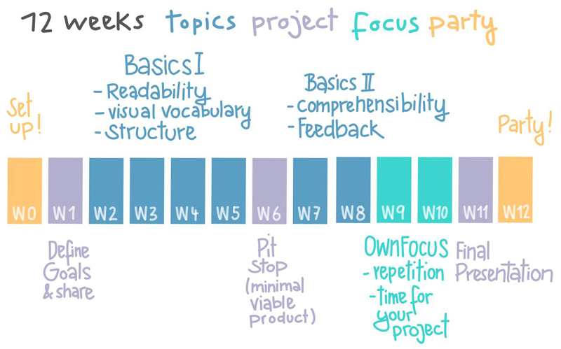
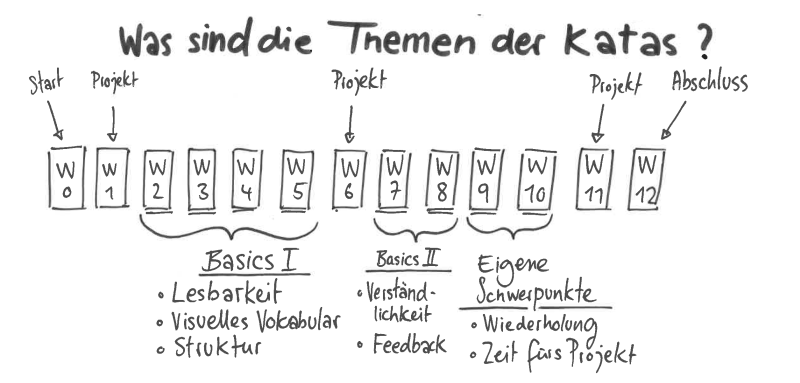
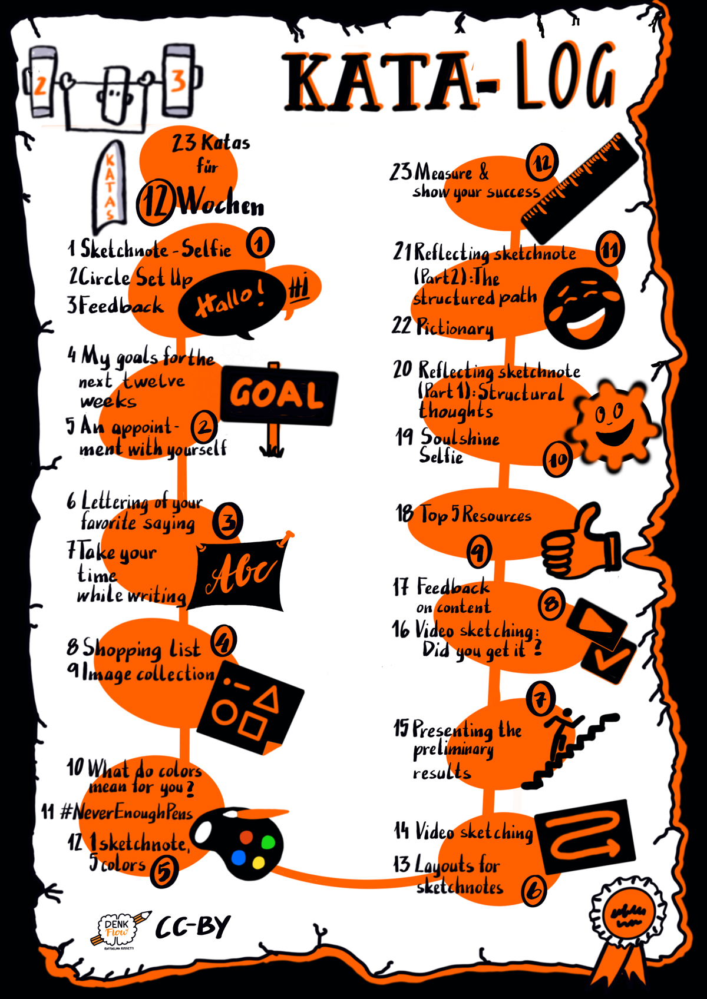

\newpage

# The Sketchnote Learning Path

This course recommends that you spend 12 weeks working on a topic. That could be both a lot of time and also very little time. The katas (exercises) in this guide are designed to help you get the most out of yourself and your circle. They are designed to be suitable for both beginners and advanced students. Before you start the sprint, take some time to look at the structure and the individual katas. Sometimes there are several katas in one week.hoose one or do both, depending on your mood. There is no kata police: simply exchange katas or modify them to fit your goals better. You can also have a look at the other [LernOS guides](https://github.com/cogneon/): Which katas do they suggest? Are they better suited for you?

**How is this learning path structured?**

Let's look at it from two perspectives. First, we look at when you are part of a learning circle over the twelve weeks. Then we look at the katas regarding the structure.

{#small .center height=250}

Sketchnoting is different for everyone and will always be different for you too, depending on the situation. Nevertheless, there are essential qualities that characterize a sketchnote that bears returning to even after years, and which can be understood by your colleagues. Toselli, mentioned above, has been developing a working list of these qualities for years. We took his list and built the Katas on them.

{#small .center height=250}

## How do I find more Circle Members?

A group of students studying the same thing is called a learning circle in this text. If you’re eager to start, but don't know where to find other circle members, what can you do? 

If you are in social networks like Facebook, Instagram or Twitter, post there and ask for interested people. If you use the hashtags #lernOS and #sketchnoting in your post, people following those threads will see it as well. You can also tag the authors of the guide, so your post can be seen and forwarded more easily.

## Circle Organizer Checklist

**#ProTipp:** in many cases, the weekly meeting does not have enough time for doing the exercises. Therefore we use the [flipped classroom method](https://en.wikipedia.org/wiki/Flipped_classroom). For each weekly, there is a kata, which each circle member prepares as "homework," so you have more time to discuss the results in the weekly. This is accompanied by guiding questions, which you are welcome to add.here are also shorter katas that you do together during the weekly.

You should choose your focus for the sprint:
- What do you want to learn or deepen?
- In which skills are you already confident?
- What is challenging?
- What's up right now?
- What's next?
- What would be a better  focus for a different  sprint?
- Are you “one-and-done” but find it frustrating?
- Or would you rather aim at "practice makes progress (and fun)" (building on Brandy Agerbeck’s awesome phrase.)

{#small .center height=500}

The katas listed here are suggestions. Think of them not as prescriptive, but as inspirational.. If there are different katas to choose from, which one fits your focus best?  Or do you want to do them all? If you have your own ideas for katas (or variations) that suit your main emphasis, even better, use them! And if you share them with us or add them to the learning path yourself, you will help all the others who follow the learning path after you! (... and of course, earn some tasty karma!)

On the following pages, you will find a short version of the sprint schedule. The explanations for the individual katas and warm-ups follow on the pages after that.
