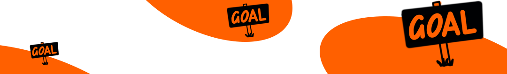

\newpage

## Week 1: Setting goals

This week you choose your goal for the sprint. 

**As preparation**

- [ ] [Kata 4](0500_Kata_04.md): My goal for the next 12 weeks

- [ ] [Kata 5](0500_Kata_05.md): An appointment with yourself

**In the weekly**

- [ ] Check-in (2 minutes per member)

- [ ] Warm-up: Goals (5 minutes) 

How do you visualize goals? Draw icons and compare them. How do you visualize that the goals have been achieved?

**Share: Your goals in the sprint (10 minutes per member)**

- [ ] Share your goals from Kata 4.

**Key questions**:

- Why are you doing this?
- What inspires you?
- What does it mean to you to have achieved a goal?
- How did you make your goals quantitatively measurable according to OKR?
- How do you celebrate when you have reached your goal?

**Share: An appointment with yourself (5 minutes)**

- [ ] Have you all set up an appointment with yourselves in the calendar? What helped you?

- [ ] Check-out (1 minute per member)
