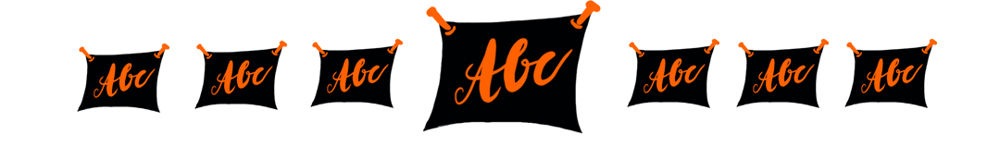

\newpage

## Week 2: Writing & Readability

Week 2 is about the written word: How does it best support the message of your sketchnote, and how do you get there?

**As preparation**

- [ ] [Kata 6](0500_Kata_06.md): Letter your favourite saying

- [ ] [Kata 7](0500_Kata_07.md): Take your time while writing

**In the weekly**

- [ ] Check-in (2 minutes per member)

- [ ] Warm-up: Very big and very small.

- [ ] Feedback, share and tips on the katas (40 minutes)

**Key questions**:

- How do you use different fonts in your sketches?
- Which of your fonts do you use for what?
- Which of your fonts do you like best? Which ones don't you like?
- Do you want to learn a new font, and what do you need it for?
- How do pens and writing relate to each other? What is the best pen thickness for your drawing and writing? How do you hierarchize with font size, fonts and pen thickness?

- [ ] Show each other your examples that you find particularly successful.

- [ ] Check-out (1 minute per member)
