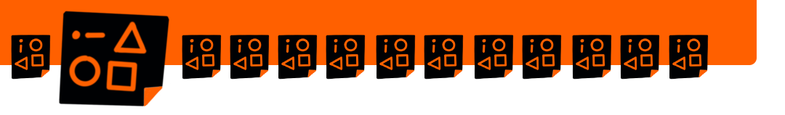

\newpage

## Week 3: Visual Vocabulary

Each language consists of individual elements: Develop the visual elements that best suit your visual language and find your style.

This guide brings together many resources (books, videos, social media accounts). You can also find inspiration there and use these resources as a source of inspiration.

You can use the current sprint as an opportunity to start working on your visual vocabulary or to collect visual vocabulary on a specific topic. Maybe this will be your project for this sprint.

**As preparation**

- [ ] [Kata 8](0500_Kata_08.md): Shopping list

- [ ] [Kata 9](0500_Kata_09.md): Icon collection

**In the weekly**

- [ ] Check-in (2 minutes per member)

- [ ] Warm-up: Icons 

- [ ] Averyone brings a term with them they find exciting or challenging to visualize. All words are sketched for 30 seconds each and then compared. (5 minutes)

- [ ] Share your experiences with the kata(s) (40 minutes)

**Key questions**: 

- How good is your visual vocabulary?
- How do you collect/document your icons?
- What methods do you use to keep them within reach?
- Do you want to continue collecting icons, and how do you want to share them?
- Which icons are your top 5 icons that you use again and again in sketches?
- How satisfied are you with them?
- Can you improve something about them?
- Sketch the icon you want to improve and ask the others.

- [ ] Check-out (1 minute per member)
