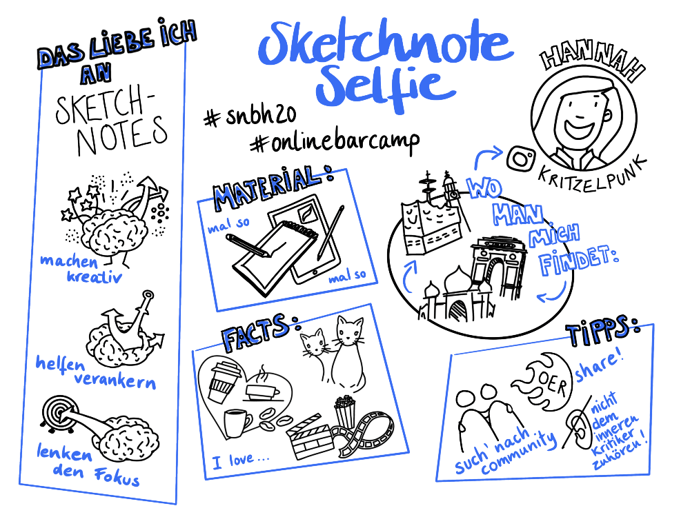

## Kata 1: Sketchnote-Selfie

Used in [Week 0](0410_Week_00.md)

To introduce yourself to others in your circle, draw a sketchnote about yourself. Include the following.
- The most important facts about yourself
- Things you do and don’t like
- Two facts about yourself that are not obvious
- A handy sketchnote tip.
Also, try to answer the question of why you visualize. Feel free to use the guiding questions from week 0, which you could edit in your Sketchnote selfie. When you're done, share your Sketchnote selfie with the others.

Example of a Sketchnote Selfie:

{#mid .center height=300}

{#mid .center height=300}

If you are still very new to sketching, the kata ["25 Facts About Me"](https://cogneon.github.io/lernos-for-you/en/2-1-8-Kata-8/)  might be a good starting point. And to make it easier to visualize the 25 or as many facts as you'd like to have on your selfie, you might find some inspiration in the [Noun Project](https://thenounproject.com/).

{#mid .center height=300}

**Objective: **

- Get to know the other members and introduce yourself with a sketchnote.
- With a Sketchnote Selfie, you show yourself and the others what you already know.

