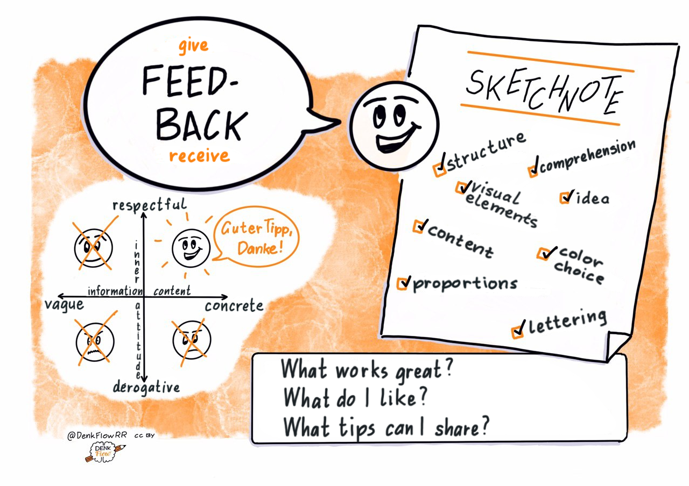

## Kata 3: Feedback!

Used in [Week 0](0410_Week_00.md)

{#mid .center height=400}

An essential function of the circle is to get feedback on your goals and sketches and to give feedback to others. To help you understand each other better, take a few moments to talk about your idea of constructive feedback, including the question "Why do you visualize? And the principle "Compare yourself with yourself".

**More information:**

- Brandyfesto: [Drawing as a thinking tool](http://www.graphicfacilitator.com/brandyfesto/Brandyfesto_112211.pdf)
- Doug Neill: [Sketchnoting is a superpower](https://www.youtube.com/watch?v=lQft0_nL9eI)
- Video: Doug Neill: [How to critique your sketchnote](https://www.youtube.com/watch?v=BPHA2-uxBto)

**Objective: **

- You set up a safe space for giving and receiving feedback.