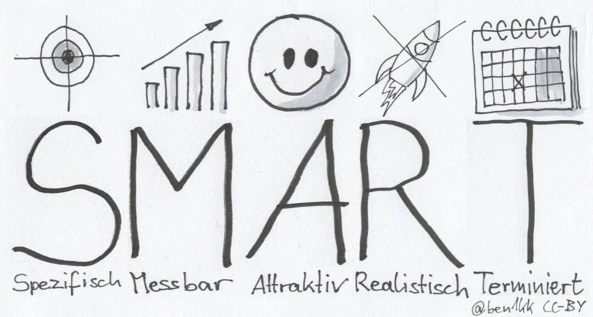
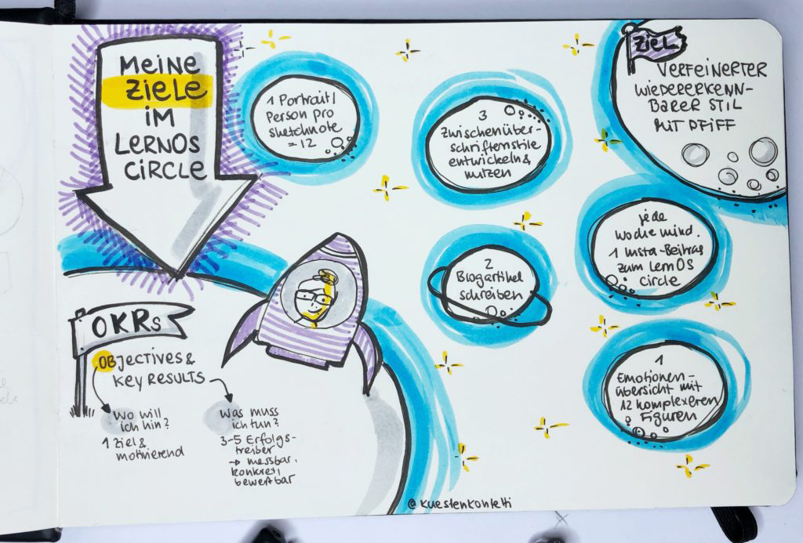
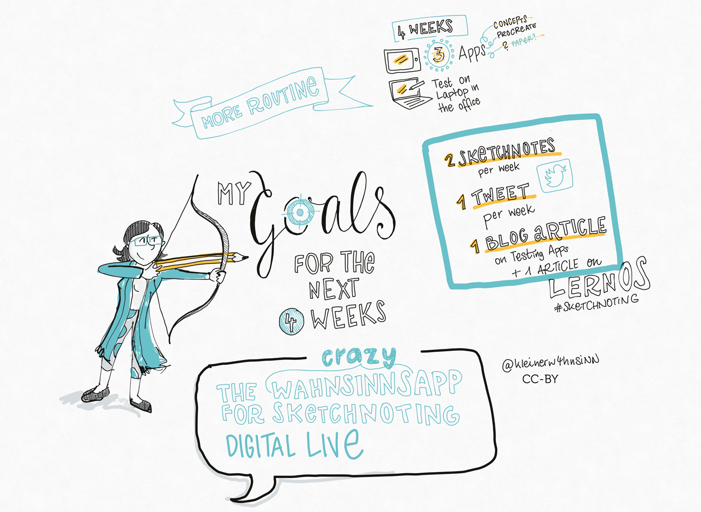

## Kata 4: My goals for the next 4 weeks

Used in [Week 1](0410_Week_01.md)

What do you want to achieve in the next twelve weeks? Choose a goal that is really important to you and where you can make progress in the sprint. Especially for sketchnote beginners*, reaching the goal is not the top priority. The focus is not only learning the primary know-how, such as the acquisition of your own visual ABC’s, but regularly practicing the newly acquired skills. And finally, the main thing is: have fun :-) To achieve optimal learning success, it is nevertheless vital to set yourself goals that motivate you and with which you can make your progress tangible and visible. You will set your goals using the SMART formula (see more on this below) or use Google's OKR method to define your goal or purpose. Think about whether you might want to work towards a specific product. This could be, for example, a sketchnote workshop for colleagues, your first graphic recording, or, or, or…

Think about how you want to share your progress in the circle. There may not be enough time in the check-in. Is there a way to track your progress in your documentation tool?

**Define goals with the SMART formula:**

{#mid .center height=200}

An excellent way to define a goal is to use the "SMART" method. It uses the following criteria.

**S**pecific: Is it clear what you want to do, or is it perhaps too vague? What does or doesn’t it involve? Only if you know exactly what you want to do within the limits of your project can you be sure that you will get where you want to g

**M**easurable:  What must happen so that you can say that you have reached your goal? What result do you need to see? For example, if you want to become "better" at something, it is not measurable without formulating "better" more clearly. In this case, you have to ask yourself questions like "Better than what? How exactly do I determine "better"? The first point can already serve you well because the more specific you are in defining your goal, the more likely you are to get a result that you can evaluate.

**A**ttractive: Your goal must motivate you. You have to want to achieve it if you're going to have the strength to make it come true for 12 weeks. Therefore, this point is especially important. It is best to have a goal that you have personally chosen for yourself and with which you can identify 100%. A goal that others set for you will seldom trigger the same motivation as one that came from your own heart. In some versions of the SMART formula the A also stands for achievable. This means that your goal should not be too easy. You should try a little bit harder and make it more challenging. If you stay in your comfort zone, you can rarely improve. But be careful. Overtaxing yourself doesn't help, and for most of us this learning path should bring one thing above all: a lot of fun! 

**R**ealistic: As symbolized by a crossed-out rocket in the graphic, you figuratively have to stay on the ground when defining your goals. The learning path is 12 weeks, and therefore you should choose a goal that you can achieve in this time. Are you one of those people who likes to make their goals a bit more challenging? Then you should ask yourself once again whether what you have set is feasible. How much time do you have available in a week? Does the whole thing fit into the 12 weeks of the learning sprint? And if you have to say goodbye to one or the other idea, that's not that bad, because who says that the current Learning Sprint was the last one? :-)

**T**ime-Based: Another critical requirement for your goal is a deadline for completion. In the context of the learning sprint, you can determine this date very precisely. And it’s also important to be able to check, at any time, whether you are still on the right track with your work results, open points, and possible problems or obstacles. Or whether you might have to put more energy into your work on the project or maybe even adjust your goal to be able to reach it. In week 6, we will look at the intermediate results. It's an excellent time to look at your SMART goal again and, if necessary, readjust it.

**More information:**

- Wikipedia Article [SMART Criteria](https://en.wikipedia.org/wiki/SMART_criteria) (englisch)
- MIT Sloan Article [With Goals, FAST Beats SMART](https://sloanreview.mit.edu/article/with-goals-fast-beats-smart) (englisch)
- Article [OKR – Googles Wunderwaffe für den Unternehmenserfolg oder: Raus aus der Komfortzone](https://t3n.de/news/okr-google-wunderwaffe-valley-ziele-530092/) (german)
- Ted Talk [How We Can Make the World a Better Place by 2030](https://www.youtube.com/watch?v=o08ykAqLOxk) (englisch)
- Video How Google Sets Goals: [OKRs mit Google Ventures Partner Rick Klau](https://www.youtube.com/watch?v=mJB83EZtAjc) (englisch)
- Video [OKR-Agiles Zielmanagement für den Mittelstand](https://www.youtube.com/watch?v=_ugCKONbBNs) (german)
- Video [OKR - Führen mit Objectives and Key Results (OKRs) - so funktioniert das Google Leadership System](https://www.youtube.com/watch?v=y-aIyqMZfnE&t=) (german)
- Book [Introduction To OKRs von Christina Wodtke](https://www.oreilly.com/business/free/files/introduction-to-okrs.pdf) (englisch)
- Book [The Beginner’s Guide To OKR von Felipe Castro](https://felipecastro.com/resource/The-Beginners-Guide-to-OKR.pdf) (englisch)

**Objective: **

- To support your learning success by making your goals measurable.

- To motivate yourself and the other participants by making your goals tangible.

{#mid .center height=400}

{#mid .center height=400}
