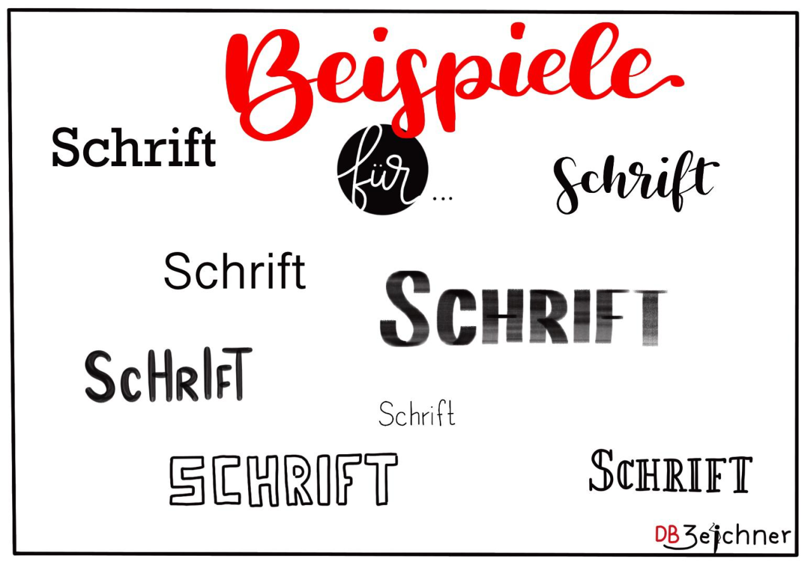
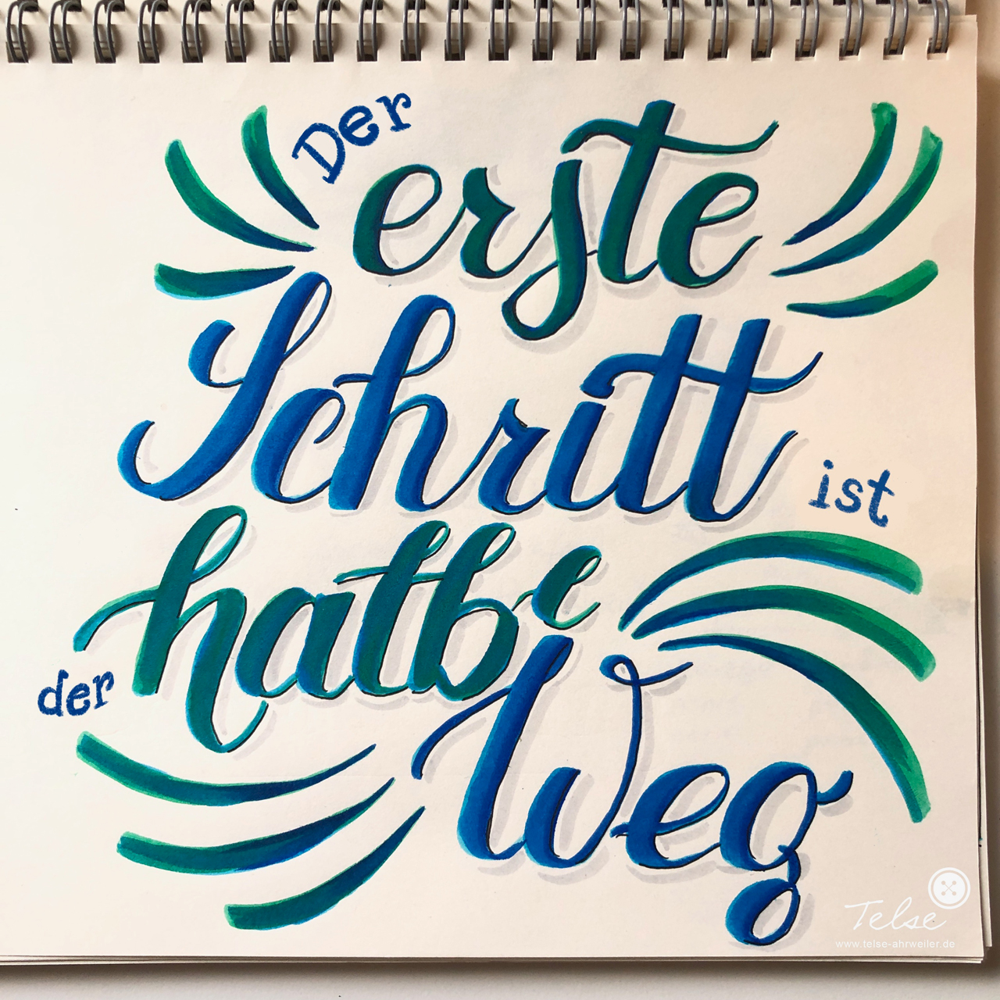
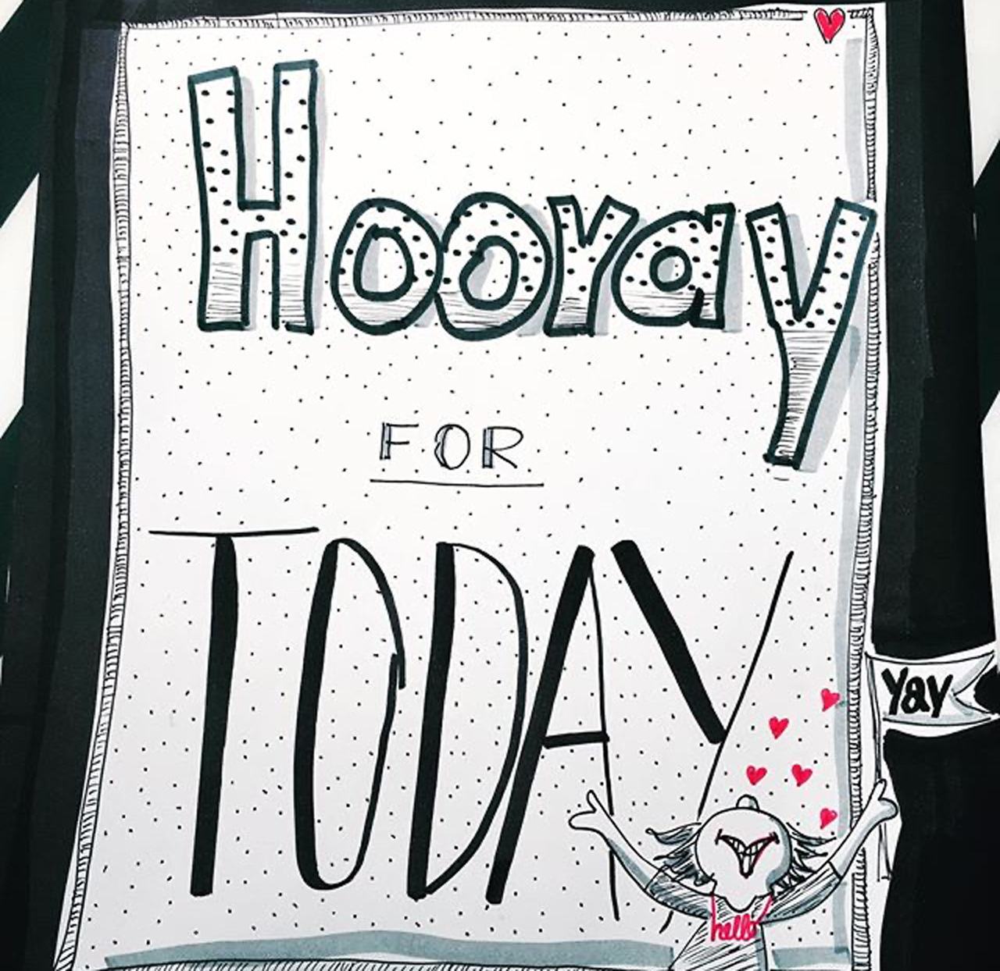
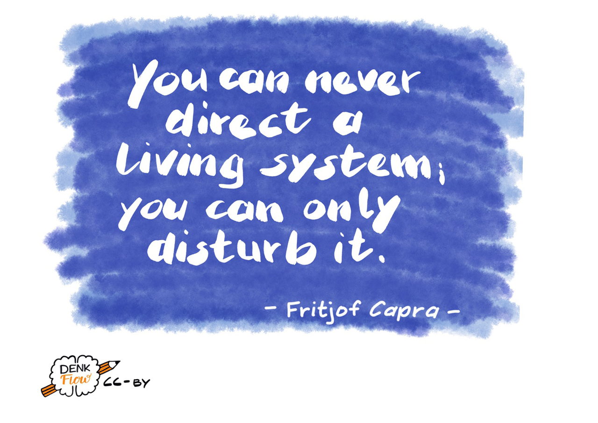
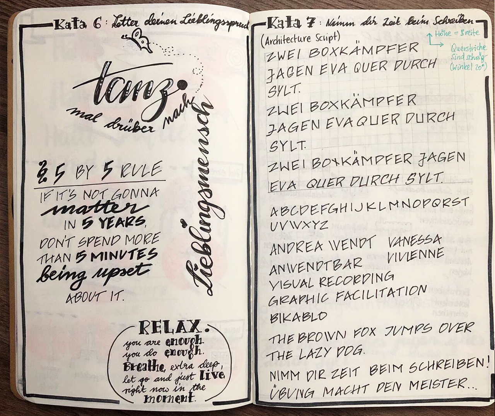

## Kata 6: Letter your favourite saying

Used in [Week 2](0410_Week_02.md)

A sketchnote can be designed and structured very well with different fonts and sizes. But often we fall back into our habits when sketching and always use the same old letters.

Take a DIN-A5 sheet (Half of an 8.5x11 in America) and a not-too-long quote of your choice for this kata. Think about which words you want to write in which font and in which size. What is especially important? What emotions resonate? Perhaps you make a small pencil sketch for the proportions and then draw in clean lines. If you need inspiration for fonts, check out the corresponding cards in the Sketchnote Game.

**More information:** 

- Video: [How to Write Neatly + Improve Your Handwriting](https://www.youtube.com/watch?v=_QA_NScPlt8)
- Video: [How to Improve your Handwriting | For Note-Taking and Journaling](https://www.youtube.com/watch?v=1YXjAu9o11o)
- Video: [5 tips on how I improved my handwriting](https://www.youtube.com/watch?v=aK2SLQx6j9Q)

{#mid .center height=300}

**Objective:**

- To recognize which fonts are available in your repertoire.
- To add more new fonts to your repertoire.
- To recognize fonts as stylistic devices and use them accordingly.

{#mid .center height=300}

{#mid .center height=300}

{#mid .center height=300}

{#mid .center height=300}