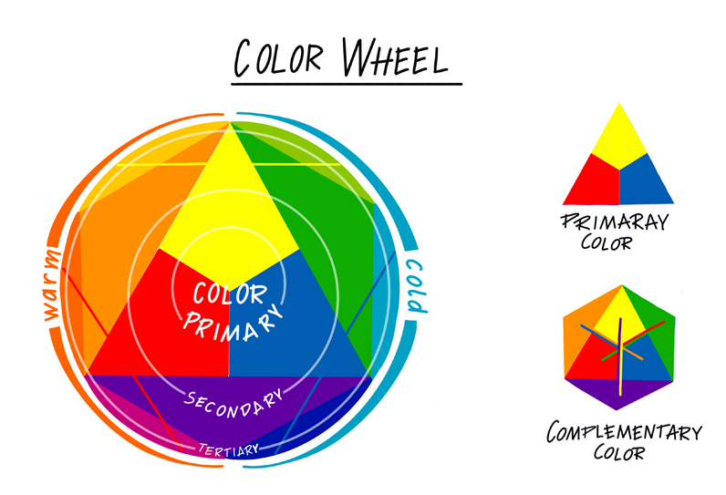

## Kata 10: Was bedeuten Farben für dich?

Verwendet in [Week 4](0410_Week_04.md)

Farben transportieren Emotionen direkter als jedes Layout. 
Beantworte die folgenden Fragen für dich.

- Welche Farben magst du?
- Welche Farben benutzt du für deine Sketchnotes?
- Benutzt du die Farben konsistent?
- Welche Funktionen erfüllen Farben für dich?
- Wie kannst du Farben als Code verwenden?

Tauscht euch über die Ergebnisse aus.

Gibt es Unterschiede in der Wahrnehmung?

Ändert sich daraus etwas für dich?

**Weitere Informationen:**

- Video Brandy Agerbeck: [The color spectrum](https://www.youtube.com/watch?v=s5h0wOtEWcg) 

{#mid .center height=300}

**Lernziel:**

- Du reflektierst, welche Farben du verwendest und wie du sie einsetzt.
- Du bekommst Anregungen durch die anderen Teilnehmer\*innen, wie diese Farben einsetzen.