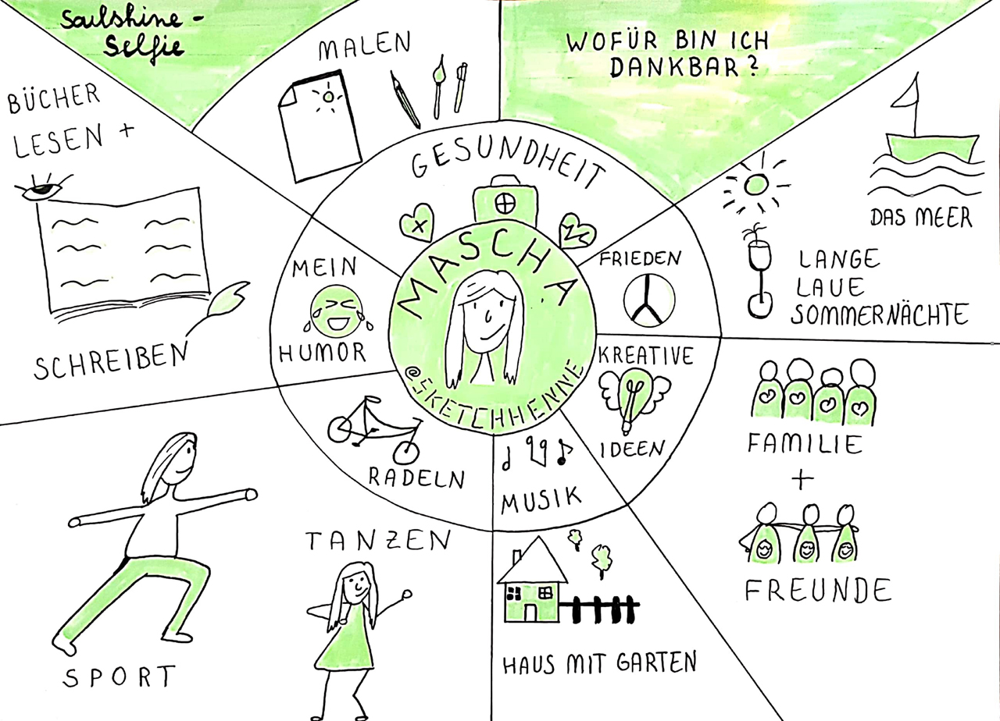

## Kata 19: Soulshine-Selfie

Used in [Week 9](0410_Week_09.md)

What are you personally thankful for in your life? It can be things, people, but also situations or special memories? Do you think about the sunny side of life and beautiful things often enough? We all experience it far too often and we forget the happy moments far too quickly. We tend to only concentrate on our  problems.

**Exercise (30 minutes)**

Create a sketchnote of things you like, love, and simply appreciate in your life. Draw yourself in the center, e.g. in front of a "sun" and arrange your "sources of happiness" around it. Give each of them a caption or a short text. Thereby you will benefit from the "Dual-Encoding Theory" and keep them better anchored in your memory.

Check out the [#SoulshineSelfie Posts](https://www.instagram.com/explore/tags/soulshinekalender/) on Instagram or the [story behind them](http://www.vizworks.de/soulshine-kalender/) for inspiration.

**Leitfragen:**

- What do you feel when you look at your Soulshine-Selfie?
- Can you imagine following this exercise over a more extended period?

{#mid .center height=300}

**Objective:**

- To practice humility and gratitude.
- To make transparent the things that consciously make you happy in your everyday life.
- To practise using visual language to depict circumstances.
- To practise layout design.

